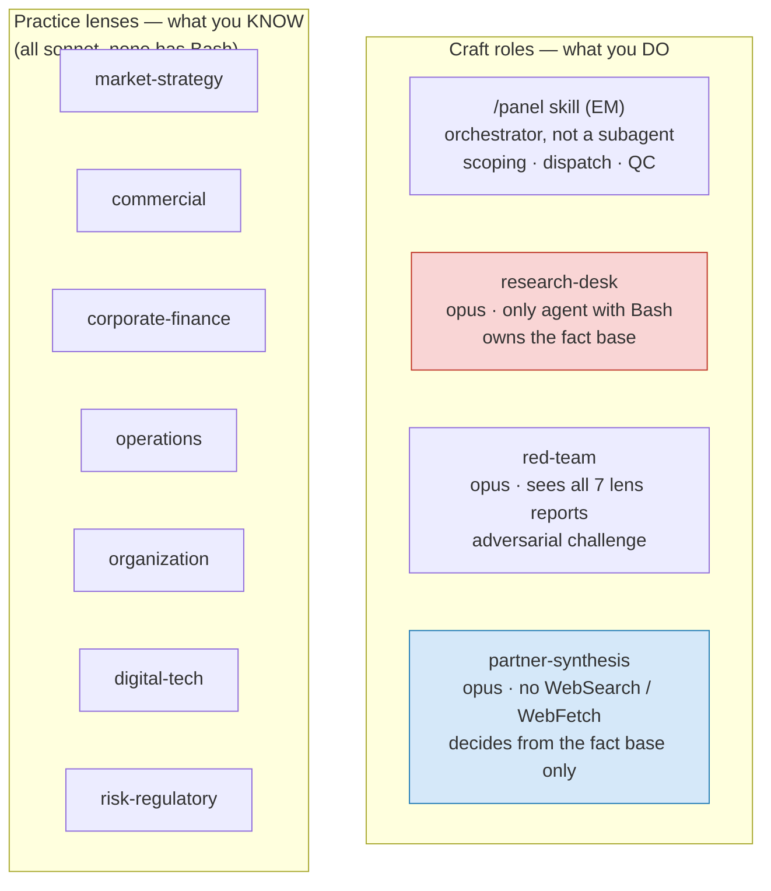
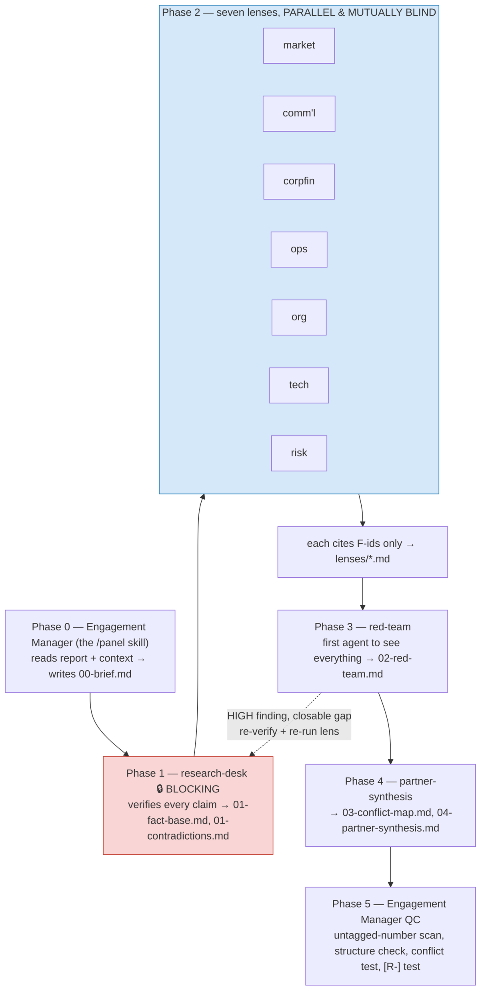
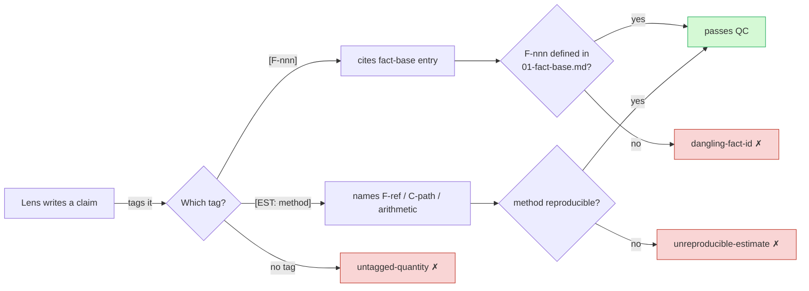
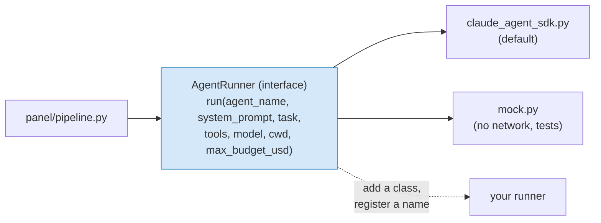

# Architecture

A strategy panel that takes a market research report and returns a defensible recommendation — built as ten agents with a verification spine, an isolation rule, and a challenge function.

---

## The design problem

Three requirements shaped every decision here, and they pull against each other.

**Independent perspectives.** Seven practice lenses must reach their own conclusions. If they see each other's work while forming a view, they converge — the second agent anchors on the first, and by the seventh you have one opinion wearing seven hats. The disagreements are the product; a panel that agrees with itself has told you nothing you could not have got from one agent.

**No hallucination.** MBB work is defensible or it is worthless. A number a client cannot trace to a source is a liability, and one wrong figure in a steering committee costs more credibility than the whole deck buys.

**Recurring, daily.** Which means the cost of a round matters a great deal — thirty rounds a month, not four — and, less obviously, the panel must be honest about the days where nothing happened, since at daily frequency most of them will be.

These are in tension. Independence multiplies cost. Verification multiplies cost further. Daily cadence multiplies it hardest of all — a weekly schedule spends on a full round roughly four times a month; daily spends the delta-review cost up to thirty times. The architecture resolves this by making verification a **shared, once-per-round asset** rather than something each lens redoes, and by making quiet days genuinely, deeply cheap — the delta review has to cost close to nothing, because it runs almost every day.

---

## Two axes, not one

The initial instinct for a panel like this is corporate functions: Finance, HR, Legal, IT. That is the wrong decomposition for a strategy team, because it mirrors an org chart rather than the structure of a strategic question.

An engagement team is organised on two orthogonal axes:

- **Craft roles** — what you *do*. Partner, Engagement Manager, Consultant, Research & Data Services.
- **Practice lenses** — what you *know*. Strategy, Commercial, Corporate Finance, Operations, Organization, Digital, Risk.

This system implements both. The seven lenses supply the domain views; four craft roles supply the discipline that turns seven views into one answer.

| Agent | Axis | Owns |
|---|---|---|
| `/panel` skill *(the Engagement Manager)* | Craft | Scoping, dispatch, quality control |
| `research-desk` | Craft | The verified fact base — the only citable source of numbers |
| `lens-market-strategy` | Lens | Market definition, sizing, competitive structure |
| `lens-commercial` | Lens | Demand, segmentation, pricing, customer economics |
| `lens-corporate-finance` | Lens | Unit economics, valuation, capital, value creation |
| `lens-operations` | Lens | Cost-to-serve, capacity, supply chain |
| `lens-organization` | Lens | Capability gaps, time-to-capability, incentives |
| `lens-digital-tech` | Lens | Technology displacement, data position, build/buy |
| `lens-risk-regulatory` | Lens | Regulatory trajectory, downside, tail scenarios |
| `red-team` | Craft | Adversarial challenge across all lenses |
| `partner-synthesis` | Craft | Conflict resolution, the recommendation |



The Engagement Manager is the `/panel` skill itself rather than a subagent. It needs to see every phase's output to quality-control it, which is exactly what the orchestrating context already does — making it a subagent would add a hop and lose the visibility.

---

## The pipeline



### Why Phase 1 blocks

This is the load-bearing decision in the whole design. If lenses ran before the fact base existed, each would need to verify claims itself — seven agents doing the same web searches, reaching seven slightly different numbers for the same quantity, with no shared reference to reconcile them against. Worse, an agent under time pressure with no verified source available will reason its way to a plausible figure. That is the hallucination path, and it opens the moment a lens is allowed to run unsourced.

Blocking here costs one sequential step and buys a single shared set of numbers that every downstream agent cites by ID.

### Why Phase 2 is blind

Parallelism here is not primarily an optimisation — it is what enforces the isolation. Seven agents dispatched in one message cannot read each other's output because none of it exists yet. The independence is structural rather than a rule an agent has to remember to follow.

### Why Phase 3 exists separately

The red team is the first agent permitted to see everything, and cross-lens contradiction is its richest seam. Folding this into synthesis would be a mistake: the Partner's job is to *decide*, and an agent that has just spent its effort attacking the work is poorly positioned to then back a conclusion drawn from it. Separating challenge from decision is standard MBB practice for the same reason.

---

## The evidence contract

Full specification in [`HOUSE-STANDARD.md`](HOUSE-STANDARD.md). The core of it:

Every quantified claim carries a tag. `[F-012]` means verified — the Research Desk found a source, recorded the URL, the access date, and the verbatim supporting sentence. `[R-p14]` means the input report asserts it on page 14 and **nobody has checked**. `[C-path]` is internal context. `[EST: method]` is the agent's own estimate with a reproducible derivation. `[ASSUMPTION]` is a knowingly-unevidenced premise.

The `[F-]` versus `[R-]` distinction does most of the work. Collapsing them is how a strategy team ends up confidently reselling a client's own marketing claims back to them. **Only the Research Desk can promote `[R-]` to `[F-]`** — a lens that wants a claim verified has to ask, which keeps a single agent accountable for the fact base's integrity.

Facts are graded A through D by provenance, plus `U` for unverified. A `U` grade is a finding, not a failure: when a report's central market-size figure cannot be corroborated, that tells you something important about the report.

Enforcement is at Phase 5 and is mechanical throughout. Three checks run over every lens report, the red team's, and the synthesis: a quantity carrying no evidence tag is a defect; a cited `[F-nnn]` that no fact-base entry defines is a defect; and an `[EST: ...]` whose method names neither a fact, nor a context file, nor visible arithmetic is a defect. The fact base is read as a *source of definitions* rather than scanned as another report — its own numbers correctly carry no citations.



The second of those is the one that matters most. Without it, a fabricated or mistyped fact id is indistinguishable from a real citation to every other check in the system, and propagates through seven lenses into the recommendation. It costs about fifteen lines.

What this still does not check is whether a fact-base entry's recorded URL resolves, or whether the verbatim quote is actually on that page. Grade A currently means "the Research Desk says it read the actual number" — an unfalsifiable first-person claim once the session ends. Closing that requires fetching the URL and confirming the quote, which is planned but not built.

---

## Cost

*Estimates below are modelled from published token pricing and expected context sizes — they are `[EST]` by this system's own standard, not measured. Run three rounds and replace them with observed figures.*

Model assignment reflects where capability actually pays back:

| Agent | Model | Reasoning |
|---|---|---|
| `research-desk` | Opus 5 | Verification discipline — knowing when a source does *not* support a claim is the hard part |
| 7 lenses | Sonnet 5 | Near-Opus on structured analytical work; this is 70% of round volume |
| `red-team` | Opus 5 | Finding the broken middle step in a well-written argument |
| `partner-synthesis` | Opus 5 | Judgment under conflicting evidence |

Per full round, at Opus 5 ($5/$25 per MTok) and Sonnet 5 ($3/$15):

| Phase | Est. cost |
|---|---|
| Research desk | ~$1.60 |
| Seven lenses | ~$3.15 |
| Red team | ~$1.15 |
| Partner synthesis | ~$1.10 |
| **Full round** | **~$7** |
| Delta review (quiet day) | ~$1.50 |

At **daily** cadence the delta review's cost is the number that actually matters, because it runs on nearly every one of the thirty days a month, not on three out of four weeks. A realistic month — say four new reports plus twenty-six delta reviews — lands around **$67**, versus roughly $12 on a weekly schedule. That five-to-six-times jump is the direct price of daily frequency, and it is worth stating plainly rather than discovering on a bill: **daily cadence is a cost decision, not just a scheduling one.**

Two levers if that cost becomes a constraint, in order of how much they help at daily frequency:

- **Shrink the delta review itself.** It is already scoped to one `research-desk` dispatch, but a cheaper trigger check — Sonnet 5 instead of Opus 5, or a narrower prompt that only re-checks the named triggers rather than re-reading the whole prior synthesis — pays off thirty times a month instead of the four-to-five times a lens-roster cut would.
- Move `red-team` to Sonnet 5 (saves ~$0.70 per *full* round, some loss in challenge quality), or drop to a five-lens roster for routine reports — these still help, but they discount the ~$28/month of full rounds, not the ~$39/month of delta reviews that dominates at daily cadence.

Do not economise on the Research Desk itself — it is the cheapest phase and the one everything else depends on.

### Why not a vector database

For a context corpus under a few thousand pages, file-based agentic search — `grep`, `glob`, and an accurate `INDEX.md` — outperforms retrieval. Opus 5 and Sonnet 5 both carry a **1M token context window**, and each subagent gets its own, so seven lenses have seven independent windows rather than seven slices of one. A retrieval layer would add infrastructure, index staleness, and chunk-boundary errors in exchange for solving a capacity problem that does not exist at this scale.

The interface is retrieval-shaped anyway: agents ask the index what exists and open what they need. If the corpus ever outgrows the approach, an embedding index slots in behind `INDEX.md` without touching a single agent prompt.

**Prompt caching note:** concurrent requests sharing a prefix all miss the cache, since none can read what the others are still writing — so the seven parallel lenses do not share cached context. This costs nothing here, because the file-based design means each lens reads only its own slice plus the shared brief, rather than a large common prefix.

---

## Daily cadence

A daily round on a report that has not changed produces noise, and at daily frequency this is the default case rather than the exception — most days, nothing a strategy panel would care about has actually moved. The `/panel` skill handles this with a **delta review**: read the previous synthesis's "what would change our view" triggers, dispatch only the Research Desk to check whether any has fired, and stop if none has.

This is the discipline that keeps a recurring panel credible, and it matters more at daily cadence than it would weekly. A panel that manufactures findings to justify its schedule stops being read within a month at weekly frequency; at daily frequency the same failure — a "finding" every single day — would be obvious and would burn trust within the first week. The failure is otherwise silent, because the reports keep arriving regardless of whether anything happened.

**Not yet built.** The delta-review logic above exists as instructions in the `/panel` skill (the Claude Code path) but has no equivalent in the Python `panel/pipeline.py` yet — the CLI's `run` command always executes the full five-phase pipeline. Daily scheduling via cron or CI needs the delta-review branch implemented in Python before it can run unattended; running the full ~$7 round daily instead would cost roughly $210/month rather than the ~$67 estimated above.

---

## Swappable model backend

`panel/pipeline.py` does not import `claude_agent_sdk`. It imports `panel.runners.AgentRunner` -- an interface with one method, `run(agent_name, system_prompt, task, tools, model, cwd, max_budget_usd) -> RunnerOutcome`. Everything provider-specific lives behind that boundary, in `panel/runners/`:

```
panel/runners/
  base.py               AgentRunner (abstract), RunnerOutcome
  registry.py            name -> class, lazy-imported
  claude_agent_sdk.py     the default -- wraps claude_agent_sdk.query()
  mock.py                 no network, no dependency -- canned responses, records every call
```



This split exists because "the API might get swapped for a different one" is a real, near-term possibility for this project, not a hypothetical worth over-engineering for. Concretely, it buys three things:

- **The orchestration logic cannot regress when the provider changes.** Phase blocking, parallel dispatch, budget handling, and QC are all tested against `mock` — a large share of the test suite exercises `panel/pipeline.py` directly, with zero network calls and zero dependency on `claude-agent-sdk` being installed. A provider swap that keeps the `AgentRunner` contract cannot break any of them, because they never imported the provider in the first place. Writing these tests is in fact how a real bug surfaced: `Phase.blocking` defaulted to `True` and was never overridden on phases 2-4, so a single lens failing silently killed the whole round before the red team or Partner ever ran. Only phase 1 (the fact base) is supposed to be a hard gate -- see § Why Phase 1 blocks above. That was invisible without a test that could actually watch one agent fail without spending real money.
- **`claude-agent-sdk` is an optional dependency**, not a required one (`pip install -e ".[claude-agent-sdk]"`). The base package (`pyyaml` plus the standard library) is everything the orchestrator, the agent loader, and the QC verifier need. A deployment that only ever runs against a different backend never installs Anthropic's agent SDK at all.
- **Adding a provider is additive, not invasive.** Write a class implementing `AgentRunner.run()`, register it under a name (`panel/runners/registry.py`'s `_BUILTIN_MODULES`, or `register_runner()` from outside the package entirely), and it is selectable via `panel run --runner <name>` or `RoundConfig(runner=...)`. No existing file changes.

**What crosses the boundary, and what doesn't.** `tools` and `model` are passed through as the raw strings from `.claude/agents/*.md` frontmatter (`Read, Write, Bash`; `opus`, `sonnet`, `inherit`) -- interpreting them is the selected runner's job, not the pipeline's. This is the one place a provider swap still touches something outside `panel/runners/`: a different API's tool names or model aliases mean revisiting the `tools:`/`model:` lines in the agent files, same as editing any other piece of an agent's configuration. It does not mean touching `panel/pipeline.py`, `panel/config.py`, or `panel/verify.py`.

**What a new runner does not need to reimplement.** Retries, streaming, tool-call loops, thinking-block handling, budget enforcement mechanics -- all of that is internal to whatever client library the runner wraps. `AgentRunner.run()` only has to return `RunnerOutcome(text, turns, error)` once the underlying call is done. A runner built directly on the Claude Messages API (bypassing the Agent SDK's tool loop and driving tool calls by hand) is a legitimate second implementation and would be roughly the same size as `claude_agent_sdk.py`.

---

## Extending the roster

Adding a lens is one file in `.claude/agents/` plus one line in the `/panel` skill's Phase 2 dispatch list. Copy an existing lens and change three things:

1. **The question it owns** — stated as something the other lenses demonstrably do not cover
2. **The number it owns** — its section 4; one figure it contributes to the decision
3. **Where it stops** — explicit handoffs, so it does not write another lens's section

That third item does the most work. Lenses without a stated boundary drift toward general commentary, and six agents all writing general commentary is a worse panel than four with sharp edges.

Industry lenses (Healthcare, Financial Services, Industrials) work the same way and can be swapped in per engagement — keep the practice lenses standing and rotate the industry one.
