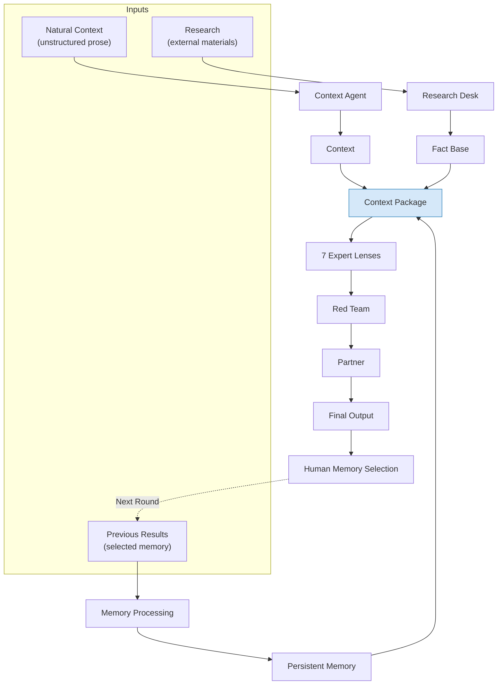
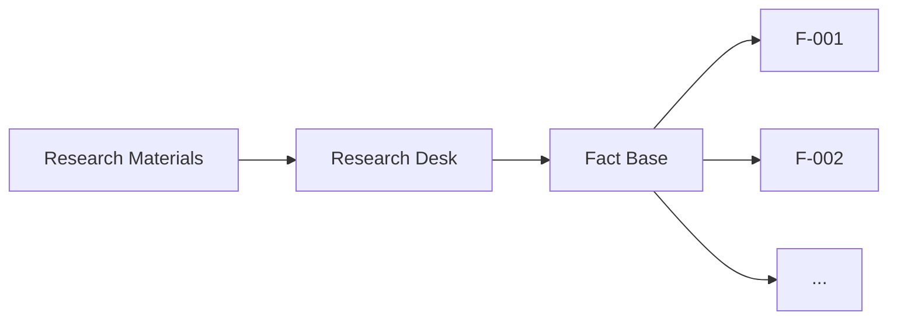
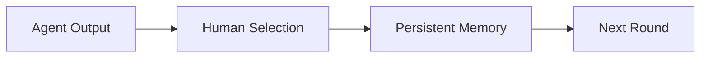
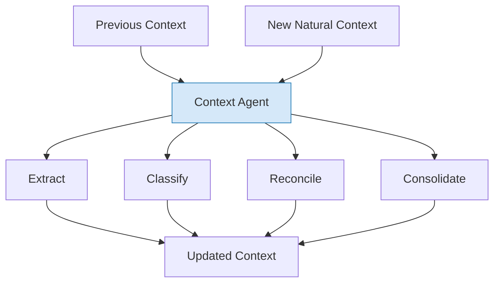
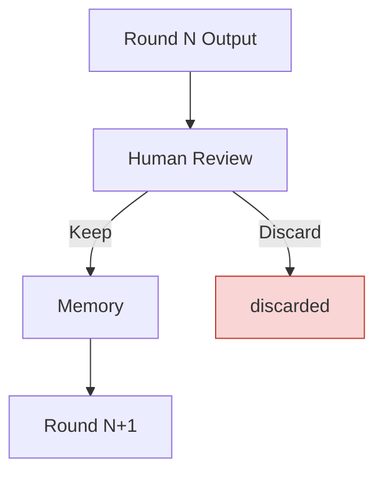
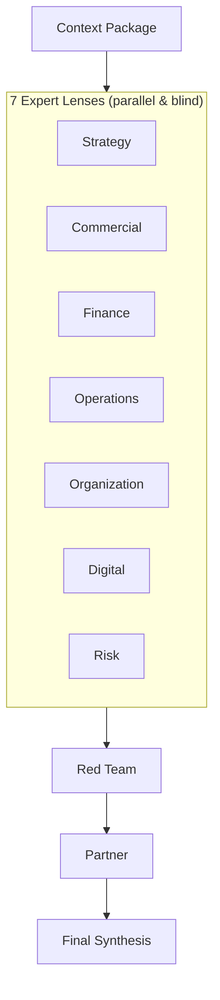
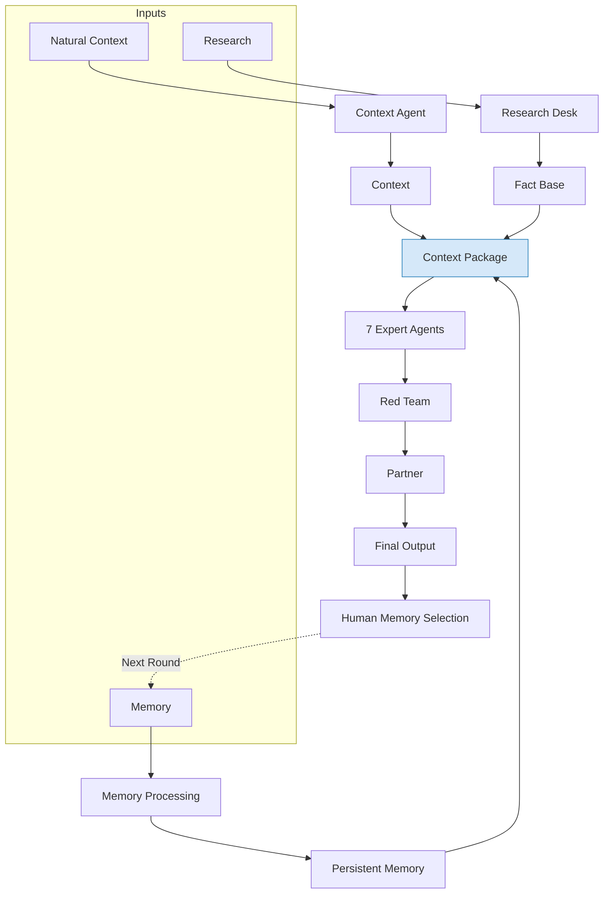
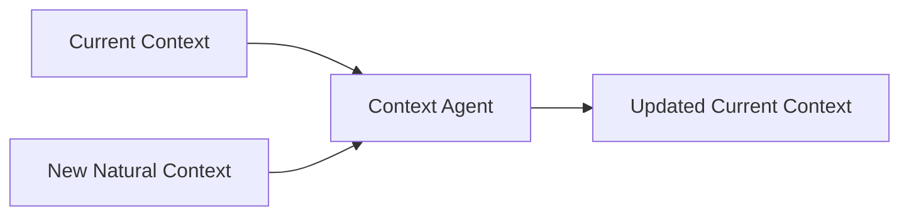
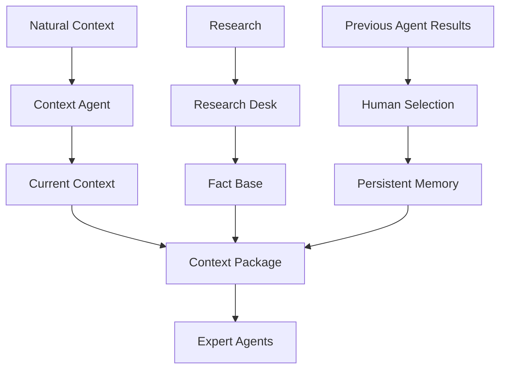

# Context & Memory Architecture

> 한국어: [`docs/ko/CONTEXT-MEMORY-ARCHITECTURE.md`](ko/CONTEXT-MEMORY-ARCHITECTURE.md)
>
> **Status:** this document describes a *target* architecture. The Context Agent and the Persistent Memory pipeline are not implemented yet — the repository today is a file-based prototype built from `context/` (current context), `inbox/` (input reports), and `reports/` (round outputs). The current-vs-target split is spelled out again in [§12](#12-current-implementation-vs-target-architecture). The panel pipeline itself (7 lenses → red team → partner) is already built and is covered in [`ARCHITECTURE.md`](ARCHITECTURE.md) — this document is about the layer upstream of that: what gets fed to the lenses in the first place.

Bain-AC is a multi-agent strategy panel in which several expert agents analyse the same project context independently, then pass through a Red Team and a Partner to produce a strategic conclusion.

---

## 1. The overall shape

The core of Bain-AC is taking three different kinds of information, refining each one appropriately, and combining them into a single shared Context Package before handing it to the expert agents.



---

## 2. Three inputs

### 2.1 Natural Context

Natural Context is the unstructured information a person enters about the project today, in plain language.

No particular format is required. For example:

- Today's meeting notes
- A conversation with management
- Interview notes from a client or practitioner
- Thoughts jotted down today
- Notes pulled from email or chat
- A human's own interpretation after reading a piece of research
- A free-form description of where the project currently stands

Example:

> Talked to the CFO today — they think we could enter Germany faster than expected. That said, they don't want initial investment to grow past €20M. Competitor A's pricing is still on their mind.

Natural Context does not enforce a predefined input schema.

### 2.2 Research Materials

Research is external material supplied as a separate input.

For example:

- Google Sheets
- Notion
- Excel / CSV
- PDF research reports
- Other documents

Research is not processed the same way as Natural Context, because the point of Research is specifically to verify claims and build a Fact Base.



The Fact Base preserves provenance wherever possible — source, evidence, access date, confidence/grade. This grading scheme is already implemented by the `research-desk` agent; see [`HOUSE-STANDARD.md`](HOUSE-STANDARD.md) for the full contract.

### 2.3 Human-selected Memory

The third input is whatever a person, after reviewing a prior round's agent output, decides is worth carrying into the next analysis.

**Every agent output from the previous round is not automatically carried forward.**



Example:

> German market entry should be considered only after 2027.

If a person selects this as Memory, it becomes available to the next analysis too.

Memory can therefore hold more than plain facts:

- Strategic judgments
- Decisions taken
- Management's stated direction
- Project constraints
- Recurring insights worth keeping
- Hypotheses carried forward from a prior analysis

---

## 3. The three inputs pass through different nodes

The three sources are different in kind, so they are not run through the same prompt.

| Input | Meaning | Processing node | Output |
|---|---|---|---|
| Natural Context | Unstructured context supplied by a person today | Context Agent | Context |
| Research | External investigation / research material | Research Desk | Fact Base |
| Previous Agent Results | Past results a person chose to preserve | Memory Processing | Persistent Memory |

By the time an expert agent begins its analysis, though, all three results have been combined into one Context Package.

---

## 4. Context Agent

The Context Agent is not simply an agent that summarises Natural Context.

Its core role is **turning unstructured, day-to-day natural language into a durable, continuously usable project context.**



**Core functions**

1. Extract the information that matters
2. Classify what kind of information it is
3. Compare it against the existing context
4. Decide whether it's new, a change, a duplicate, or a conflict
5. Consolidate it into the context the next round of analysis will use

### 4.1 Consolidation, not append

Suppose the existing context says:

> German market entry should be considered only after 2027.

And today's new input says:

> The CFO mentioned entry could happen sooner than expected, but this isn't a confirmed decision yet.

Simply appending the second sentence to the first would leave two conflicting statements sitting side by side. The Context Agent can instead resolve this into:

> The existing baseline was entry after 2027. The CFO has recently raised the possibility of earlier entry, but since this is not yet a confirmed decision, it does not formally supersede the existing direction.

In other words, Context is not a simple append — it's a consolidation that compares existing information against new information.

---

## 5. Memory does not remember everything

If every agent output were fed into Memory indefinitely, the following would keep accumulating:

- Stale judgments
- Hypotheses already abandoned
- Analysis that was only ever valid at the time
- Past opinions that now contradict each other

So the initial design defaults to **human-in-the-loop.**



Only what a person selects enters Persistent Memory.

---

## 6. Context Package

After each of the three inputs is refined, they are combined into a single Context Package before being handed to the expert agents.

```
┌──────────────────────────────────────┐
│            CONTEXT PACKAGE            │
├──────────────────────────────────────┤
│ Project Context                       │
│ - Current situation                   │
│ - Management priorities               │
│ - Recent observations                 │
│                                        │
│ Verified Research Facts               │
│ - [F-001] ...                         │
│ - [F-002] ...                         │
│                                        │
│ Persistent Memory                     │
│ - [M-001] ...                         │
│ - [M-002] ...                         │
└──────────────────────────────────────┘
```

This reduces the problem of Strategy, Commercial, Finance, and the other experts starting from different information bases.

---

## 7. Provenance is preserved

Combining information into a Context Package does not mean collapsing its provenance. Each piece of information keeps its own origin.

| Tag | Meaning |
|---|---|
| `[F-031]` | Verified Research Fact |
| `[C-014]` | Natural Context |
| `[M-007]` | Human-approved Memory |

This lets an expert agent tell apart:

- Is this a fact independently verified against an external source?
- Is this context a person supplied today?
- Is this something that came out of a past round's analysis?

This connects directly to the Evidence Contract in `HOUSE-STANDARD.md` — `[F-]` and `[C-]` are already the tag vocabulary the lenses use today; `[M-]` is the third provenance kind that gets added to that vocabulary once Memory is implemented.

---

## 8. Expert Agents

Once the Context Package is ready, several expert lenses analyse it independently, all starting from the same Context Package.

| Agent | Primary focus |
|---|---|
| Market Strategy | Market definition, market attractiveness, strategic positioning |
| Commercial | Customers, pricing, revenue, competition |
| Corporate Finance | Profitability, investment, value, finance |
| Operations | Production, supply chain, cost, feasibility |
| Organization | Structure, people, capability |
| Digital / Tech | Technology shift, digital, displacement risk |
| Risk / Regulatory | Regulation, risk, downside |



The agent roster and the tool/model differences between them are already laid out in [`ARCHITECTURE.md` § Two axes, not one](ARCHITECTURE.md#two-axes-not-one).

---

## 9. A full round



Same flow as §1 — repeated here after walking through each stage in §2–§8, so the whole shape is visible again in one place.

---

## 10. Fact Base vs. Memory

Both can be used in the next analysis, but they serve different purposes.

**Fact Base** — a fact verified by Research

```markdown
[F-012]
Claim: Germany market size = ...
Source: ...
Evidence: ...
Grade: A
```

The Fact Base demands as strict a standard of evidence and provenance as possible.

**Memory** — information a person chose to carry forward from a past analysis into future rounds

```markdown
[M-007]
Germany entry should be considered
after 2027.
Source: Round 2026-08-17
Status: Human-approved
```

Memory does not have to be an objective fact. A strategic judgment or a decision can be Memory too.

---

## 11. Current Context vs. History

The Context Agent does not re-inject every past piece of raw material into the prompt on every run. By default it works from:



Raw source material and past versions are preserved as History.

```
context/
├── current/
│   ├── project_context.md
│   └── ...
│
└── history/
    ├── round-001/
    ├── round-002/
    └── round-003/
```

Only when needed does the system additionally retrieve the last N rounds, or a specific piece of past content.

---

## 12. Current implementation vs. target architecture

The current repository is closer to a file-based prototype.

```
context/     → the current context
inbox/       → material to be analysed
reports/     → per-round results
```

`context/` today does not mean a fully built Memory system that refreshes itself automatically every day. Nor does the architecture require a separate PostgreSQL or vector database from day one.

**Target structure**



In other words, the Context Agent / Memory / Context Package described in this document both describe the current implementation as far as it goes, and define the target architecture to build toward.

---

## 13. Future storage structure

File-based, Markdown storage is sufficient early on.

As the service grows, a structure like the following becomes worth considering.

```
PostgreSQL
├── projects
├── contexts
├── memories
├── facts
├── documents
├── rounds
└── agent_runs

Object Storage
├── raw research files
├── source documents
└── generated reports
```

The point is not simply storing an LLM's conversation history. The following need to be stored as structured data:

- Fact
- Context
- Memory
- Decision
- Evidence
- Provenance
- Round
- Agent Run

And on every round, only the information that's needed is retrieved to assemble the Context Package.

If vector search becomes necessary, the architecture can extend to something like PostgreSQL + pgvector — a separate vector database is not required from the outset, for the same reason laid out in `ARCHITECTURE.md`'s [Why not a vector database](ARCHITECTURE.md#why-not-a-vector-database) section.

---

## 14. Design principles

1. **Take unstructured input as unstructured.** Nobody is forced to write meeting notes or a stray thought into a fixed schema.
2. **Structuring is the agent's job.** The Context Agent reads Natural Context and consolidates it into the project context.
3. **Separate Research from Context.** The Research Desk owns evidence verification; the Context Agent owns project-context consolidation.
4. **Past results are remembered selectively.** Agent output is never fed into Memory automatically.
5. **Give every expert the same world.** Each expert lens analyses from the same Context Package.
6. **Preserve provenance to the end.** Even once Context, Research, and Memory are combined into one Package, each item keeps its original source and character.
7. **Keep a human in the loop.** Anything entering long-lived Memory in particular needs to be something a person can approve.

---

## 15. One-sentence summary

Bain-AC refines project context supplied in natural language, a Fact Base verified from external Research, and past agent Memory a person chose to keep — each through the agent suited to it — combines them into a single Context Package, hands that to independent experts, and produces a strategic conclusion through a Red Team and a Partner.
