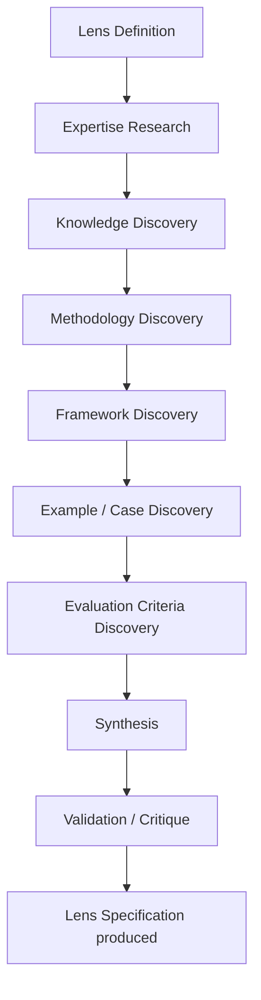
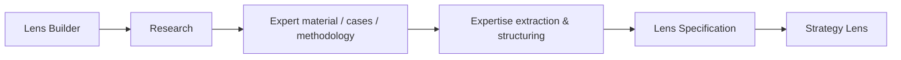
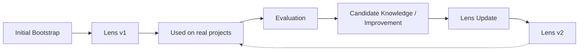
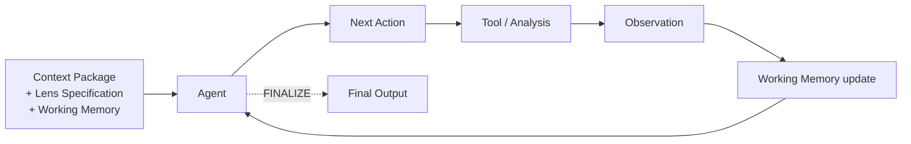
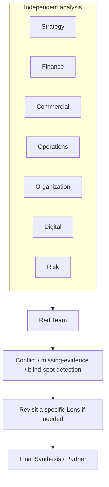
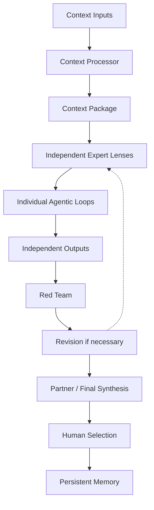
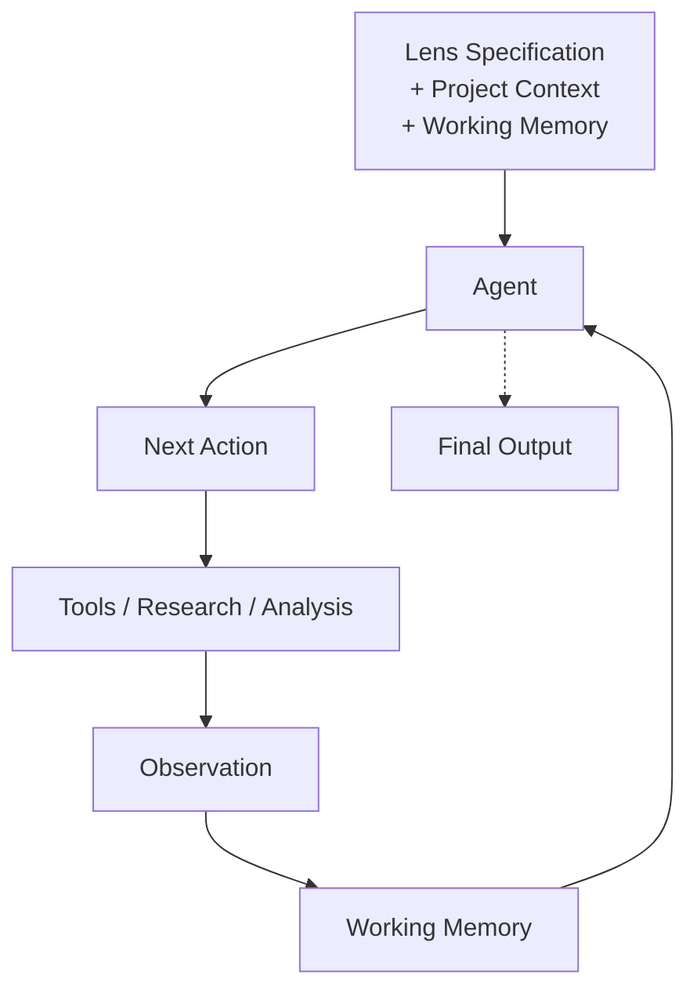

# Lens Architecture

> 한국어: [`docs/ko/LENS-ARCHITECTURE.md`](ko/LENS-ARCHITECTURE.md)
>
> **Status:** this document is a design. The Lens Builder, the Agentic Loop, Working Memory, and the two-way split of RAG are **not implemented yet.** What actually runs today is only what's listed in the §0 table — seven lens agents exist as static markdown prompts, and the parallel/isolated dispatch plus the Red Team that runs after them is already built. The panel pipeline itself is covered in [`ARCHITECTURE.md`](ARCHITECTURE.md); what feeds the lenses is covered in [`CONTEXT-MEMORY-ARCHITECTURE.md`](CONTEXT-MEMORY-ARCHITECTURE.md). This document sits between the two — **inside each lens**: what a lens is made of, how it acquires, structures, and stores expertise, how it reasons while it runs, and how it improves through real use.

In Bain-AC, a Lens is not just a prompt or a role instruction. A Lens is a "domain-expert team member."

Examples: Strategy Lens, Finance Lens, Commercial Lens, Operations Lens, Organization Lens, Digital Lens, Risk Lens.

Every Lens receives the same project context and analyses it independently, from its own domain's point of view.

---

## 0. Current implementation vs. this document

Before anything else: which of the elements described in this document actually exist in the repository today, and which exist only as design. Every section below cites this table again where it applies.

| Design element | Current implementation | Status |
|---|---|---|
| Lens Specification (Role/Objective/Core Questions/…/Action Space) | `.claude/agents/lens-*.md` is frontmatter (`name`, `description`, `tools`, `model`) plus free-form prose. The fields `parse_agent()` in `panel/agents.py` reads are the same | **Not implemented** — expertise today is defined by prompt alone |
| `tools:` across the 7 lenses | Byte-for-byte identical on all seven: `Read, Write, Glob, Grep, WebSearch, WebFetch`, `model: sonnet` | No structural way to express a different capability mix per lens |
| Lens Builder | None. Lens files are written directly, by hand, as markdown | **Not implemented** — this document defines the concept for the first time |
| Agentic Loop / Action Space | `AgentRunner.run()` in `panel/runners/base.py` is a single call: hand over `system_prompt` + `task`, get a result back. (The Claude Agent SDK itself loops over tool calls internally, but Bain-AC's own code neither exposes nor controls that loop as an Action Space) | **Not implemented** |
| Working Memory | No data structure persists state across runner calls | **Not implemented** — defined here for the first time |
| Iteration / token / time budget control | Only `max_budget_usd` exists; no iteration cap or time limit | Partially implemented |
| Full cross-lens isolation | Phase 2 in `panel/config.py` is `parallel=True` and dispatches via `asyncio.gather` — no lens's output exists yet when another lens runs, so none can read another's (temporal isolation) | **Already implemented**, matches the design |
| Red Team as the first stage to see everything | Phase 3's `red-team` runs only after all seven lenses finish | **Already implemented**, matches the design |
| Context Package | Not implemented. Only the target architecture is documented, in `CONTEXT-MEMORY-ARCHITECTURE.md` | **Not implemented** |
| `skills:` frontmatter | Parsed, but nothing consumes it | A plausible future home for Lens Specification data — mentioned only as a possibility |
| RAG / knowledge store | The eight `context/<domain>/` folders are empty | **Not implemented** |

---

## 1. The basic definition of a Lens

The core principle:

> **Same Context, Independent Expertise, Independent Reasoning.**

That is:

- Every Lens receives the same Context Package.
- Each Lens applies its own expertise, knowledge, and methodology.
- A Lens cannot see another Lens's analysis while it is reasoning.
- Cross-lens comparison happens only afterward, at the Red Team / Synthesis stage.

The third and fourth principles are, as confirmed in §0, **already implemented.** The rest — the Context Package, and structuring expertise so it can actually be injected rather than merely asserted — is the target state this document defines.

---

## 2. Expertise is not defined by prompt alone

Structures like the following are what this design avoids:

> "You are the best strategy consultant."

**This is, precisely, the current state of the repository** — all seven lens files have byte-identical `tools:` lines, and the only differences are a few paragraphs of prose (§0, rows 1–2).

Instead, a Lens carries a structured **Lens Specification**, which includes at minimum:

- Role / Objective
- Core Questions
- Domain Knowledge
- Methodologies
- Frameworks
- Evaluation Criteria
- Evidence Requirements
- Common Failure Modes
- Reference Knowledge
- Agent Policy / Action Space

The prompt is only one part of this structure — not the whole of a Lens's expertise.

---

## 3. No fine-tuning

Bain-AC does not train Lens expertise into LLM weights. Fine-tuning is out of scope for this design.

A general-purpose model is used as-is, and domain expertise is assembled by combining:

- Lens Specification
- Domain Knowledge
- Methodologies
- Evaluation Criteria
- Reference Knowledge
- Tools
- Working Memory
- Project Context

```
General-purpose Model
        +
Lens-specific knowledge and behavior
        =
   Domain Expert Lens
```

---

## 4. A separate Lens Builder

The user is not a domain expert, so this design does not assume a person will hand-write Strategy/Finance/… expertise directly into a prompt.

A separate meta-level component, the **Lens Builder**, creates and updates Lenses. Its job is not "run an actual project" — it's **"build the expert Lens itself."**

The initial Lens-creation process:



In other words:



---

## 5. The Lens Builder does not run on every project

The Lens Builder is not an agent that re-researches expertise for every new project.

Initially, **Bootstrapping** produces Lens v1. After that, a **Lens Update** happens only when a real project surfaces a gap or new domain knowledge.



**Not every project's results are automatically merged permanently into a Lens.** Any long-lived change to Lens Knowledge goes through a validation/approval step — see [§14](#14-lens-evolution).

---

## 6. RAG plays two distinct roles

RAG is not, by itself, what builds Lens expertise. Two things are distinguished:

| | Question | When it happens | Flow |
|---|---|---|---|
| **A. Expertise Acquisition** | "How does a Strategy expert approach a problem?" | During the Lens Builder's initial build or an update | Research → Knowledge extraction → Structure → Lens Specification / Knowledge Store |
| **B. Project-time Research** | "What's this competitor's pricing on this project?" | While an actual Lens Agent runs a project, as needed | Lens → Research Tool → Current project information → Working Memory |

So expert knowledge is not re-retrieved from scratch on every project.

---

## 7. The Agentic Loop

Each Lens does not run as a single input → output prompt. It has an **Agentic Loop.**

But this is not a fixed pipeline like:

```
Research → Analyze → Critique → Final
```

Instead, the agent looks at its current state and chooses its next action.

Example action space:

- `ANALYZE`
- `RESEARCH`
- `CALCULATE`
- `CHECK_EVIDENCE`
- `REVISIT_ASSUMPTION`
- `FINALIZE`



An easy question can finish in one or two steps; a complex one should be able to run several rounds of research and analysis.

**Current implementation:** `AgentRunner.run()` is a single call (§0). The SDK's own tool-call loop exists, but it isn't exposed as an Action Space.

---

## 8. Controlling the Agentic Loop

The LLM is not given unbounded autonomy. Control at the code level is required:

- Action Space
- Maximum iterations
- Research budget
- Token budget
- Time budget
- Tool permissions
- Termination conditions

**The principle:**

| Element | Role |
|---|---|
| LLM | Judgment |
| Code | Control |
| Tools | Action |
| Working Memory | State |
| Lens Specification | Expertise |

**Current implementation:** only `max_budget_usd` (a dollar cap) exists (§0). There is no iteration cap, time limit, or explicit Action Space control.

---

## 9. Working Memory

Intermediate results produced inside the Agentic Loop are stored in Working Memory.

Examples:

- Findings
- Evidence
- Hypotheses
- Assumptions
- Open Questions
- Decisions
- Previous Actions
- Research Results

**Important:** Working Memory is not treated the same as long-lived Memory. Working Memory is state for the current agent run. What gets written to long-lived Memory (the Persistent Memory in [`CONTEXT-MEMORY-ARCHITECTURE.md`](CONTEXT-MEMORY-ARCHITECTURE.md)) has its own separate storage/selection/approval policy.

**Current implementation:** none. A runner call carries no state (§0).

---

## 10. A Lens's tools

Early implementations should not over-fragment tools. The baseline capabilities to consider are:

- Research
- Fact Base access
- Context access
- Memory access
- Calculator / Python / structured computation

A tool doesn't create expertise — it's the capability a Lens needs to actually act on the expertise it has.

```
Lens Expertise + Tools + Agentic Reasoning
```

---

## 11. Never reference another Lens's results

This one is non-negotiable.

While the Strategy Lens is analysing:

- It cannot see the Finance output.
- It cannot see the Commercial output.
- It cannot see another Lens's Working Memory.

Each Lens can only use:

- Its own Lens Specification
- The project's Context Package
- Its own Working Memory
- Its own research results
- Whatever shared data / Fact Base is explicitly permitted

**Current implementation: already implemented.** Phase 2 in `panel/config.py` dispatches all seven lenses concurrently via `asyncio.gather` — when any given lens is running, no other lens's output file exists yet, so there's nothing to read even if it wanted to. This is *temporal* isolation, though — it is not enforced at the filesystem or network level, a gap noted separately in an earlier diagnosis (out of scope for this document).

---

## 12. Red Team

Only once every Lens has finished its independent analysis are the results compared.



Cross-lens comparison is allowed at the Red Team stage — but it has to stay separate from each Lens's independent reasoning process.

**Current implementation: already implemented.** Phase 3's `red-team` runs only after all seven lenses complete, and its output (`02-red-team.md`) becomes input to Phase 4's `partner-synthesis`.

---

## 13. Relationship to the Context Package

A project's context is produced by a separate context-processing stage. The full design for that lives in [`CONTEXT-MEMORY-ARCHITECTURE.md`](CONTEXT-MEMORY-ARCHITECTURE.md) — this section only summarises the part that touches Lenses.

Three core inputs:

1. **Natural-language Context** — meeting notes, conversations, a person's own free-form thinking, unpolished notes, any other unstructured natural-language information
2. **Research** — separately supplied research material (spreadsheets, Notion, external documents, etc.)
3. **Selected Previous Results / Memory** — past agent output a person chose to carry forward long-term

Each of the three is refined appropriately and combined into one Context Package. **Every Lens receives the same Context Package.** How each Lens interprets and uses it, though, depends on its own expertise.

**Current implementation:** the Context Package itself is not implemented (§0). What a lens receives today is just the raw input report, `01-fact-base.md`, `docs/HOUSE-STANDARD.md`, and `context/00-core-brief.md` (usually still the empty template).

---

## 14. Lens Evolution

A Lens is not a fixed prompt. Real projects can surface signals such as:

- Recurring failures
- Missed analysis
- Wrong assumptions
- New methodology
- New evidence requirements
- Industry-specific considerations that keep recurring

None of this is written straight into permanent Lens storage. It's kept separate, as **Candidate Knowledge / Candidate Improvement**, and only updates the Lens Specification after validation, evaluation, and approval — the same Bootstrap/Update cycle described in [§5](#5-the-lens-builder-does-not-run-on-every-project).

---

## 15. Full architecture

**The full pipeline**



**Inside a Lens**



Both diagrams combine what §1 (the overall principle) and §7 (the Agentic Loop) already described, into one picture.

---

## A note on how to read this document

Every "current implementation" claim in this document is drawn from the [§0](#0-current-implementation-vs-this-document) table, and this documentation pass did not change any of that implementation. If any section reads as though an unbuilt feature already exists, that's a defect in this document — resolve it against the §0 table.
