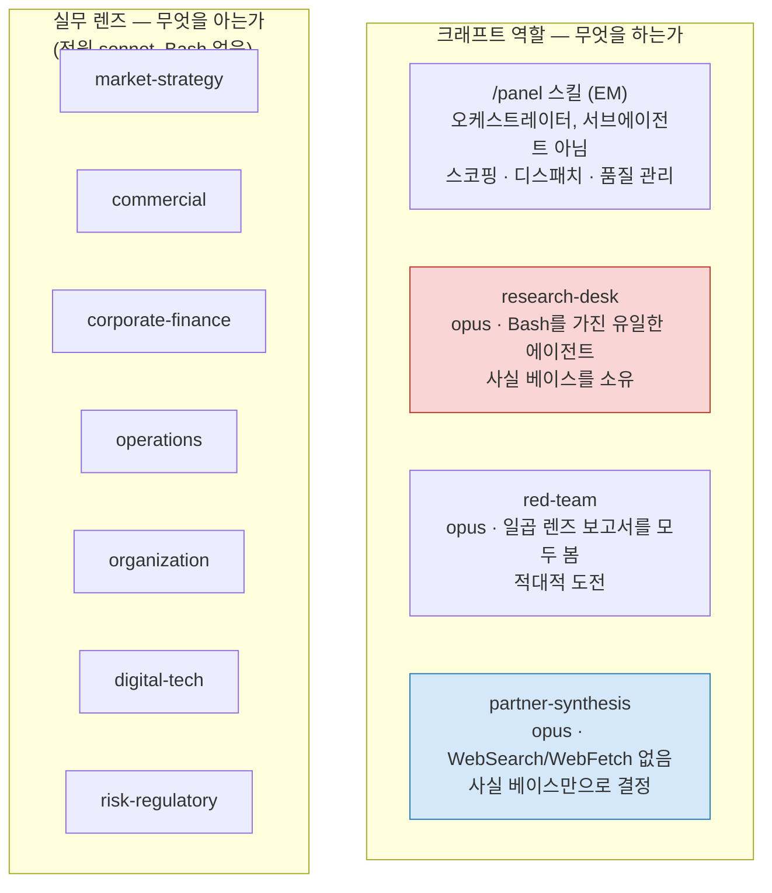
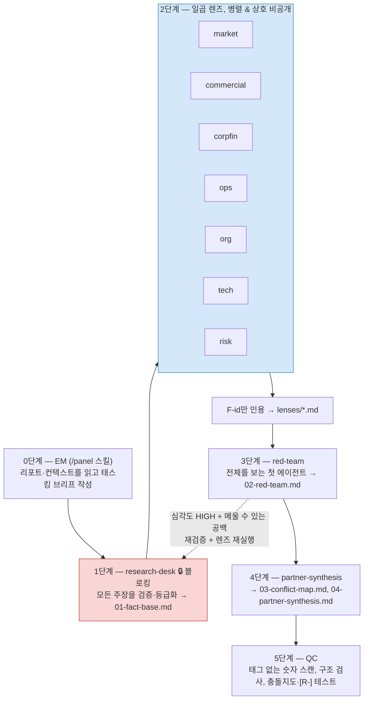
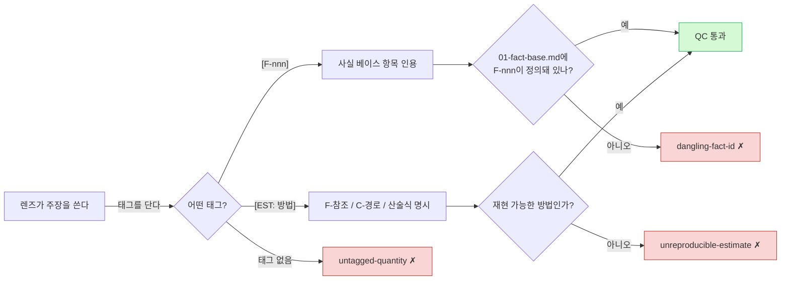
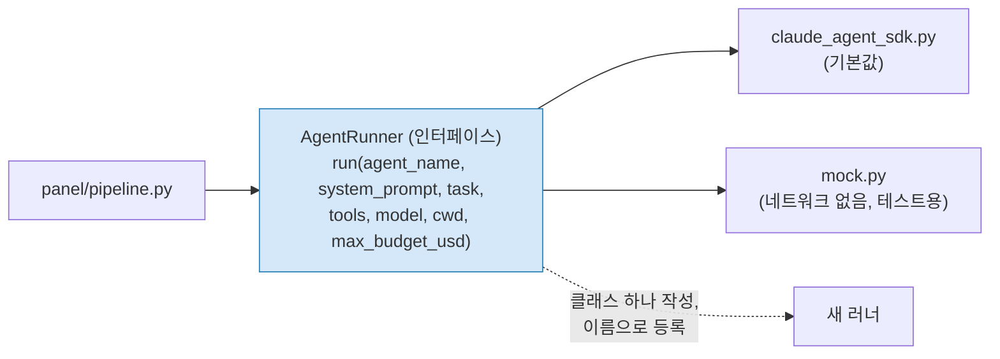

# 아키텍처

시장조사 리포트를 받아 방어 가능한 권고를 내놓는 전략 패널 — 검증 척추, 격리 규칙, 도전 기능으로 구성된 10개 에이전트.

> 영문 정본: [`docs/ARCHITECTURE.md`](../ARCHITECTURE.md)

---

## 설계 문제

세 가지 요구가 모든 결정을 규정했고, 이들은 서로 당긴다.

**독립적 관점.** 일곱 개 렌즈가 각자의 결론에 도달해야 한다. 의견을 형성하는 동안 서로의 작업을 보면 수렴한다 — 두 번째 에이전트가 첫 번째에 앵커링되고, 일곱 번째쯤이면 하나의 의견이 일곱 개의 모자를 쓰고 있게 된다. **의견 충돌이 산출물이다.** 자기 자신과 합의하는 패널은 에이전트 하나로도 얻을 수 있는 것만 알려준다.

**환각 금지.** MBB 작업은 방어 가능하거나 무가치하다. 고객이 출처를 추적할 수 없는 숫자는 부채이며, 스티어링 커미티에서 틀린 수치 하나가 잃는 신뢰는 덱 전체가 버는 것보다 크다.

**일간 반복.** 라운드 비용이 크게 중요해진다는 뜻이다 — 한 달에 4번이 아니라 30번이다. 그리고 덜 명백하게는, 아무 일도 없었던 날에 대해 패널이 정직해야 한다는 뜻이다. 일간 주기에서는 대부분의 날이 그렇다.

독립성은 비용을 곱한다. 검증은 더 곱한다. 일간 반복이 가장 크게 곱한다 — 주간 스케줄은 전체 라운드 비용을 한 달에 대략 네 번 지출하지만, 일간은 델타 리뷰 비용을 최대 서른 번 지출한다. 아키텍처는 검증을 각 렌즈가 반복하는 작업이 아니라 **라운드당 한 번의 공유 자산**으로 만들고, 조용한 날을 정말로, 깊이 싸게 만들어 이를 해소한다 — 델타 리뷰는 거의 매일 도니까 비용이 거의 0에 가까워야 한다.

---

## 축은 하나가 아니라 둘

이런 패널의 첫 직관은 기업 기능 분할이다: 재무, 인사, 법무, IT. 전략팀에는 틀린 분해다. 전략적 질문의 구조가 아니라 조직도를 반영하기 때문이다.

엔게이지먼트 팀은 직교하는 두 축으로 조직된다.

- **크래프트 역할** — 무엇을 *하는가*. 파트너, EM, 컨설턴트, 리서치 데스크.
- **실무 렌즈** — 무엇을 *아는가*. 전략, 커머셜, 재무, 오퍼레이션, 조직, 디지털, 리스크.

이 시스템은 둘 다 구현한다. 일곱 렌즈가 도메인 관점을 제공하고, 네 크래프트 역할이 그 관점들을 하나의 답으로 만드는 규율을 제공한다.

| 에이전트 | 축 | 소유 영역 |
|---|---|---|
| `/panel` 스킬 *(EM)* | 크래프트 | 스코핑, 디스패치, 품질 관리 |
| `research-desk` | 크래프트 | 검증된 사실 베이스 — 인용 가능한 유일한 숫자 출처 |
| `lens-market-strategy` | 렌즈 | 시장 정의, 규모 산정, 경쟁 구조 |
| `lens-commercial` | 렌즈 | 수요, 세그먼테이션, 가격, 고객 경제성 |
| `lens-corporate-finance` | 렌즈 | 단위 경제성, 밸류에이션, 자본, 가치 창출 |
| `lens-operations` | 렌즈 | 서비스 원가, 생산능력, 공급망 |
| `lens-organization` | 렌즈 | 역량 격차, 역량 확보 소요기간, 인센티브 |
| `lens-digital-tech` | 렌즈 | 기술 대체, 데이터 포지션, 자체개발/구매 |
| `lens-risk-regulatory` | 렌즈 | 규제 경로, 하방 시나리오, 테일 리스크 |
| `red-team` | 크래프트 | 전 렌즈에 대한 적대적 도전 |
| `partner-synthesis` | 크래프트 | 충돌 해소, 권고 |



EM은 서브에이전트가 아니라 `/panel` 스킬 자체다. 각 단계의 산출물을 봐야 품질 관리를 할 수 있는데, 그것이 오케스트레이션 컨텍스트가 이미 하는 일이다. 서브에이전트로 만들면 홉이 하나 늘고 가시성을 잃는다.

---

## 파이프라인



### 왜 1단계가 막는가

설계 전체에서 가장 하중을 받는 결정이다. 사실 베이스가 존재하기 전에 렌즈가 돌면, 각자가 스스로 검증해야 한다 — 일곱 에이전트가 같은 검색을 하고, 같은 양에 대해 조금씩 다른 일곱 개 숫자에 도달하며, 대조할 공통 기준이 없다. 더 나쁘게는, 검증된 출처를 쓸 수 없는 에이전트는 그럴듯한 수치로 추론해 간다. **그것이 환각 경로이며, 렌즈가 출처 없이 도는 것이 허용되는 순간 열린다.**

여기서 막는 비용은 순차 단계 하나이고, 얻는 것은 모든 하위 에이전트가 ID로 인용하는 단일 숫자 집합이다.

Python 런타임에서는 `await`가, Claude Code에서는 EM의 단계 검사가 이를 강제한다.

### 왜 2단계가 비공개인가

여기서 병렬 처리는 주로 최적화가 아니라 **격리를 강제하는 수단**이다. 한 메시지로 디스패치된 일곱 에이전트는 서로의 출력을 읽을 수 없다 — 아직 존재하지 않기 때문이다. 독립성이 에이전트가 기억해야 할 규칙이 아니라 구조적 속성이 된다.

코드에서는 `asyncio.gather`가 이를 보장한다.

### 왜 3단계가 분리되어 있는가

레드팀은 전체를 볼 수 있는 첫 에이전트이고, 렌즈 간 모순이 가장 풍부한 광맥이다. 이를 종합 단계에 합치는 것은 실수다. 파트너의 일은 *결정*인데, 방금 작업을 공격하는 데 노력을 쏟은 에이전트는 그로부터 도출된 결론을 옹호하기에 부적절하다. 도전과 결정을 분리하는 것은 같은 이유로 MBB의 표준 관행이다.

---

## 증거 계약

전체 명세: [`docs/ko/HOUSE-STANDARD.md`](HOUSE-STANDARD.md)

핵심은 `[F-]` 대 `[R-]`의 구분이다. `[F-012]`는 리서치 데스크가 출처·URL·접근일·원문 문장을 기록했다는 뜻이다. `[R-p14]`는 리포트가 14쪽에서 주장했고 **아무도 확인하지 않았다**는 뜻이다.

**`[R-]`를 `[F-]`로 승격할 수 있는 것은 리서치 데스크뿐이다.** 검증이 필요한 렌즈는 요청해야 하며, 이로써 사실 베이스의 무결성에 대한 책임이 한 에이전트에 집중된다.

사실은 개연성이 아니라 **출처 계보**로 등급이 매겨진다 — A(1차 출처 직접 확인), B(방법론이 공개된 2차 출처), C(교차 확인 안 된 단일 출처), D(도출 — 입력과 계산 명시), U(미검증).

**U 등급은 실패가 아니라 발견이다.** 리포트의 핵심 시장규모 수치가 교차 확인되지 않는다면, 그것은 그 리포트에 대해 중요한 사실을 말해준다 — 그리고 요약이었다면 삼켜버렸을 바로 그것이다.

집행은 5단계에서 전부 기계적으로 이루어진다. 모든 렌즈 보고서, 레드팀 보고서, 종합 문서에 대해 세 가지 검사가 돈다. 증거 태그 없는 수치는 결함이고, 사실 베이스에 존재하지 않는 `[F-nnn]` 인용은 결함이며, 사실·컨텍스트 파일·산술 중 아무것도 제시하지 않는 `[EST: ...]`도 결함이다. 사실 베이스는 *정의의 출처*로 읽지 다른 보고서처럼 스캔하지 않는다 — 사실 베이스 자신의 숫자는 인용을 달지 않는 게 정상이기 때문이다.



이 중 두 번째가 가장 중요하다. 이게 없으면 **날조되거나 오타 난 F-ID가 다른 모든 검사에게는 진짜 인용과 구별되지 않고**, 일곱 렌즈를 거쳐 최종 권고까지 전파된다. 코드는 약 15줄이다.

여전히 검사하지 못하는 것: 사실 베이스에 기록된 URL이 실제로 열리는지, 그리고 원문 인용이 정말 그 페이지에 있는지. 지금 등급 A는 "리서치 데스크가 실제 숫자를 읽었다고 말함"이라는 뜻이고, 세션이 끝나면 반증할 수 없는 1인칭 주장이다. 이걸 닫으려면 URL을 가져와 인용문을 대조해야 하며, 계획은 있으나 아직 구현되지 않았다.

**이 검사들이 LLM 호출이었다면 막으려는 실패 양상을 그대로 물려받았을 것이다.**

---

## 비용

*아래 수치는 공개 토큰 단가와 예상 컨텍스트 크기로 모델링한 것으로, 실측이 아니다. 이 시스템 자체 기준으로 `[EST]`다. 세 라운드 돌린 뒤 관측치로 교체할 것.*

| 단계 | 모델 | 근거 | 추정 비용 |
|---|---|---|---|
| 리서치 데스크 | Opus 5 | 출처가 주장을 뒷받침하지 *않는다*는 판단이 어려운 부분 | ~$1.60 |
| 일곱 렌즈 | Sonnet 5 | 구조화된 분석에서 Opus에 근접; 라운드 물량의 70% | ~$3.15 |
| 레드팀 | Opus 5 | 잘 쓰인 논증에서 깨진 중간 단계 찾기 | ~$1.15 |
| 파트너 종합 | Opus 5 | 상충 증거 하에서의 판단 | ~$1.10 |
| **전체 라운드** | | | **~$7** |
| 델타 리뷰 | | 조용한 날 | ~$1.50 |

**일간 주기에서는 델타 리뷰 비용이 월 청구액을 지배한다** — 한 달에 3~4번이 아니라 약 서른 번 돌기 때문이다. 신규 리포트 4건 + 델타 리뷰 26회로 잡으면 현실적인 한 달은 약 **$67**이고, 주간 스케줄이었을 때의 약 $12보다 5~6배 높다. 이 차이는 청구서를 받고서야 알기보다 미리 명시할 가치가 있다: **일간 주기는 스케줄 결정이기 이전에 비용 결정이다.**

비용이 제약이 되면, 일간 주기에서 실제로 도움되는 순서로:

- **델타 리뷰 자체를 줄인다.** 이미 `research-desk` 호출 하나로 범위가 좁혀져 있지만, 더 저렴한 트리거 검사 — Opus 5 대신 Sonnet 5, 또는 직전 종합 전체를 다시 읽지 않고 명시된 트리거만 재확인하는 좁은 프롬프트 — 는 렌즈 로스터를 줄이는 것보다 한 달에 훨씬 많이(30번 대 4~5번) 효과를 낸다.
- 레드팀을 Sonnet 5로 내리거나(전체 라운드당 ~$0.70 절감, 도전 품질 일부 손실), 정형 리포트에 렌즈를 다섯 개로 줄인다 — 이들도 도움이 되지만 월 ~$28인 전체 라운드 비용을 할인할 뿐, 일간 주기에서 지배적인 월 ~$39의 델타 리뷰 비용은 건드리지 않는다.

리서치 데스크 자체에서는 아끼지 마라 — 가장 싼 단계이면서 나머지 전부가 의존하는 단계다.

### 왜 벡터 DB를 쓰지 않는가

수천 쪽 미만의 컨텍스트 코퍼스에서는 파일 기반 에이전틱 검색 — `grep`, `glob`, 정확한 `INDEX.md` — 이 검색 증강(RAG)보다 낫다. Opus 5와 Sonnet 5 모두 **100만 토큰 컨텍스트 윈도**를 가지며 서브에이전트마다 자기 윈도를 받으므로, 일곱 렌즈는 하나를 일곱 조각으로 나누는 것이 아니라 독립된 일곱 개를 쓴다.

검색 계층은 인프라, 인덱스 노후화, 청크 경계 오류를 더하면서 이 규모에서는 존재하지 않는 용량 문제를 푼다. 인터페이스는 어차피 검색 형태다 — 에이전트가 인덱스에 무엇이 있는지 묻고 필요한 것을 연다. 코퍼스가 이 방식을 넘어서면, 에이전트 프롬프트를 한 줄도 건드리지 않고 `INDEX.md` 뒤에 임베딩 인덱스를 끼워 넣으면 된다.

**프롬프트 캐싱 주의:** 동일 프리픽스를 가진 동시 요청은 모두 캐시를 놓친다. 서로가 아직 쓰는 중인 것을 읽을 수 없기 때문이다. 따라서 병렬 렌즈 일곱 개는 캐시를 공유하지 않는다. 파일 기반 설계에서는 각 렌즈가 공유 브리프와 자기 슬라이스만 읽으므로 손실이 없다.

---

## 일간 주기

바뀌지 않은 리포트에 대한 일간 라운드는 소음을 만든다. 일간 주기에서는 이것이 예외가 아니라 기본값이다 — 대부분의 날, 전략 패널이 신경 쓸 만한 것은 실제로 움직이지 않는다. `/panel` 스킬은 이를 **델타 리뷰**로 처리한다: 직전 종합의 "무엇이 생각을 바꾸는가" 트리거를 읽고, 리서치 데스크만 디스패치해 발동 여부를 확인하고, 아무것도 안 바뀌었으면 멈춘다.

이는 반복 패널이 신뢰를 유지하기 위한 규율이며, 주간보다 일간에서 더 중요하다. 일정을 정당화하려고 발견을 만들어내는 패널은 주간 주기라면 한 달 안에 아무도 안 읽게 되는 정도였겠지만, 일간 주기에서 매일 "발견"을 보고하는 같은 실패는 첫 주 안에 신뢰를 무너뜨릴 만큼 뚜렷하다. 그렇지 않으면 이 실패는 조용히 진행된다 — 실제로 무슨 일이 있었는지와 무관하게 보고서는 계속 도착하기 때문이다.

**아직 구현 안 됨.** 위 델타 리뷰 로직은 Claude Code 경로(`/panel` 스킬)의 지시문으로만 존재하고, Python `panel/pipeline.py`에는 대응하는 코드가 없다 — CLI의 `run` 명령은 항상 5단계 전체 파이프라인을 실행한다. cron이나 CI로 무인 일간 실행을 하려면 이 델타 리뷰 분기를 Python에 먼저 구현해야 하며, 그렇지 않고 전체 라운드(~$7)를 매일 돌리면 위에서 추정한 ~$67이 아니라 월 약 $210이 든다.

---

## 교체 가능한 모델 백엔드

`panel/pipeline.py`는 `claude_agent_sdk`를 import하지 않는다. 대신 `panel.runners.AgentRunner` — 메서드 하나짜리 인터페이스 `run(agent_name, system_prompt, task, tools, model, cwd, max_budget_usd) -> RunnerOutcome` — 를 import한다. 프로바이더별 구현은 전부 `panel/runners/` 뒤에 있다.

```
panel/runners/
  base.py               AgentRunner(추상), RunnerOutcome
  registry.py            이름 → 클래스, 지연 임포트
  claude_agent_sdk.py     기본값 — claude_agent_sdk.query()를 감쌈
  mock.py                 네트워크·의존성 없음 — 정해진 응답 반환, 모든 호출 기록
```



"API를 다른 걸로 바꿀 수도 있다"는 이 프로젝트에서 실제로 가까운 미래에 일어날 수 있는 일이지, 과설계할 가치가 있는 가상의 시나리오가 아니다. 이 분리는 구체적으로 세 가지를 얻는다.

- **프로바이더가 바뀌어도 오케스트레이션 로직이 퇴행할 수 없다.** 단계 블로킹, 병렬 디스패치, 예산 처리, QC 전부 `mock`을 대상으로 테스트된다 — 테스트 스위트의 상당 부분이 네트워크 호출 없이, `claude-agent-sdk` 설치 여부와 무관하게 `panel/pipeline.py`를 직접 검증한다. `AgentRunner` 계약을 지키는 프로바이더 교체는 이 테스트들을 깨뜨릴 수 없다 — 애초에 프로바이더를 import한 적이 없기 때문이다. 실제로 이 테스트를 작성하는 과정에서 진짜 버그 하나가 드러났다: `Phase.blocking`이 기본값 `True`였는데 2~4단계에서 명시적으로 덮어쓰지 않아서, 렌즈 하나만 실패해도 레드팀·파트너가 돌기 전에 라운드 전체가 조용히 종료되고 있었다. 원래 1단계(사실 베이스)만 강제 게이트여야 한다 — 위 "왜 1단계가 막는가" 참조. 실제 돈을 쓰지 않고 에이전트 하나를 실패시켜 관찰할 수 있는 테스트가 없었다면 보이지 않았을 문제다.
- **`claude-agent-sdk`는 선택 의존성**이지 필수가 아니다 (`pip install -e ".[claude-agent-sdk]"`). 기본 패키지(`pyyaml`과 표준 라이브러리)만으로 오케스트레이터·에이전트 로더·QC 검증기가 전부 돌아간다. 다른 백엔드만 쓰는 배포 환경은 Anthropic의 에이전트 SDK를 아예 설치할 필요가 없다.
- **프로바이더 추가는 침습적이지 않고 가산적이다.** `AgentRunner.run()`을 구현하는 클래스를 쓰고, 이름으로 등록하고(`panel/runners/registry.py`의 `_BUILTIN_MODULES`, 또는 패키지 밖에서 `register_runner()` 호출), `panel run --runner <이름>` 또는 `RoundConfig(runner=...)`로 선택 가능해진다. 기존 파일은 하나도 바뀌지 않는다.

**경계를 넘는 것과 넘지 않는 것.** `tools`와 `model`은 `.claude/agents/*.md` frontmatter의 원본 문자열(`Read, Write, Bash`; `opus`, `sonnet`, `inherit`) 그대로 전달된다 — 해석은 선택된 러너의 몫이지 파이프라인의 몫이 아니다. 프로바이더를 바꿀 때 `panel/runners/` 바깥에서 유일하게 손댈 곳이 여기다: 다른 API의 도구 이름이나 모델 별칭 체계가 다르면 에이전트 파일의 `tools:`/`model:` 줄을 다시 써야 한다 — 에이전트 설정의 다른 어떤 부분을 편집하는 것과 동일한 일이다. `panel/pipeline.py`, `panel/config.py`, `panel/verify.py`는 건드리지 않는다.

**새 러너가 다시 구현할 필요 없는 것.** 재시도, 스트리밍, 도구 호출 루프, 사고(thinking) 블록 처리, 예산 집행 메커니즘 — 이 전부는 러너가 감싸는 클라이언트 라이브러리 내부의 일이다. `AgentRunner.run()`은 실제 호출이 끝난 뒤 `RunnerOutcome(text, turns, error)`만 반환하면 된다. Claude Messages API 위에 직접 구현한 러너(에이전트 SDK의 도구 루프를 우회하고 도구 호출을 직접 처리하는)도 정당한 두 번째 구현이고, `claude_agent_sdk.py`와 비슷한 규모일 것이다.

---

## 두 개의 런타임

같은 에이전트 정의가 두 환경에서 돈다.

| | Claude Code (`/panel`) | Python (`panel run`) |
|---|---|---|
| 용도 | 대화형, 탐색적 | 헤드리스, 스케줄, CI |
| 단계 강제 | EM 프롬프트 | `await` / `asyncio.gather` |
| QC | grep + EM 판단 | `panel/verify.py` (순수 함수, 40개 테스트) |
| 예산 상한 | 없음 | `--budget` (에이전트당) |
| 출력 언어 | 프롬프트 지시 | `--lang ko` (로드 시 주입) |

`.claude/agents/*.md`가 **단일 진실 원천**이다. 전략가는 Python을 건드리지 않고 렌즈 프롬프트를 편집할 수 있고, 같은 파일이 두 런타임에서 그대로 작동한다. `panel/agents.py`가 이를 SDK 객체로 변환하는 다리이며, 로스터의 두 번째 정의가 아니다.

---

## 로스터 확장

렌즈 추가는 `.claude/agents/` 파일 하나와 `panel/config.py`의 `LENSES` 한 줄이다. 기존 렌즈를 복사해 세 가지를 바꾼다.

1. **소유하는 질문** — 다른 렌즈가 명백히 다루지 않는 것으로 서술
2. **소유하는 숫자** — 4절. 의사결정에 기여하는 하나의 수치
3. **멈추는 지점** — 명시적 인계. 다른 렌즈의 절을 쓰지 않도록

세 번째가 가장 많은 일을 한다. 경계가 명시되지 않은 렌즈는 일반론으로 표류하고, 여섯 에이전트가 모두 일반론을 쓰는 패널은 날이 선 넷보다 나쁘다.

산업 렌즈(헬스케어, 금융, 산업재)도 같은 방식이며 엔게이지먼트별로 교체 가능하다 — 실무 렌즈는 고정하고 산업 렌즈만 회전시킨다.

`tests/test_agents.py`가 로스터와 파이프라인의 정합성을 검사하므로, 정의 파일만 추가하고 config 등록을 빠뜨리면 테스트가 실패한다.
