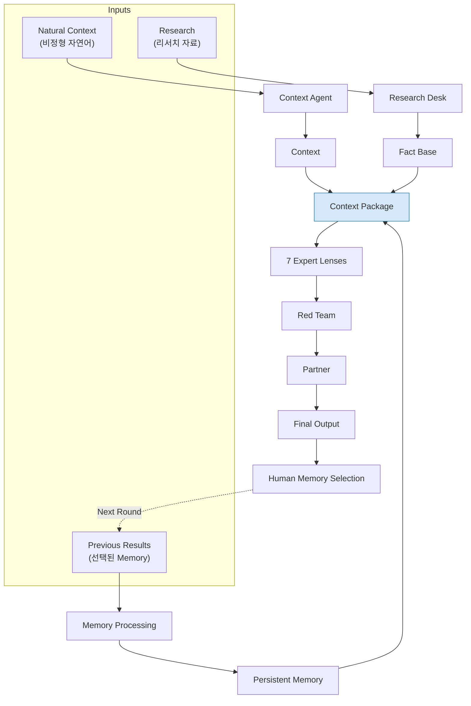
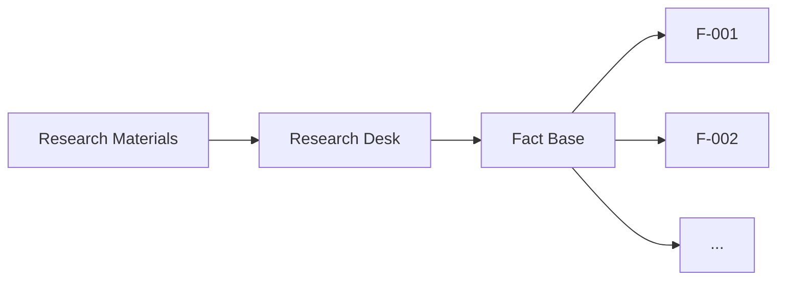
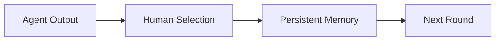
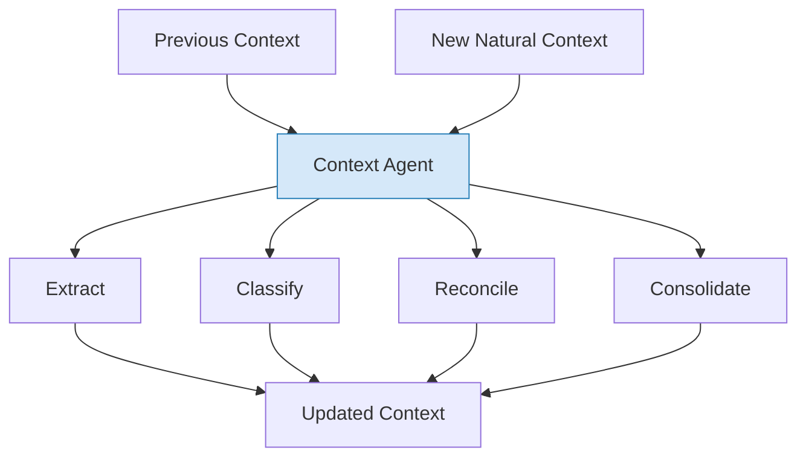
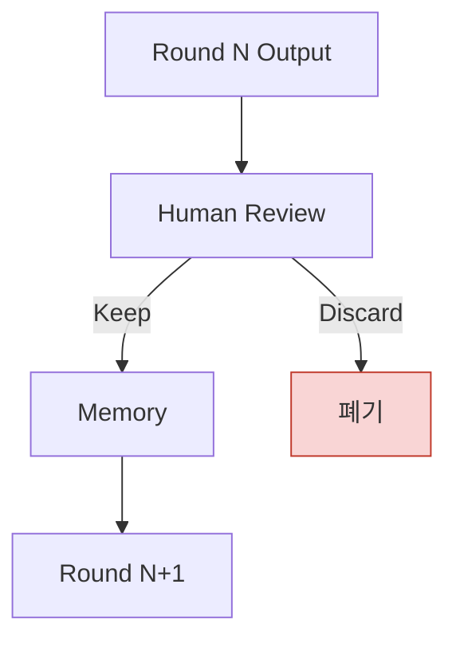
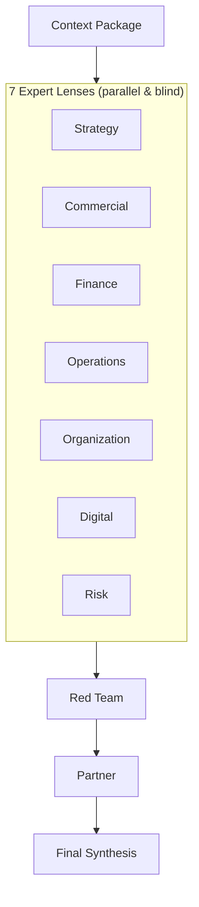
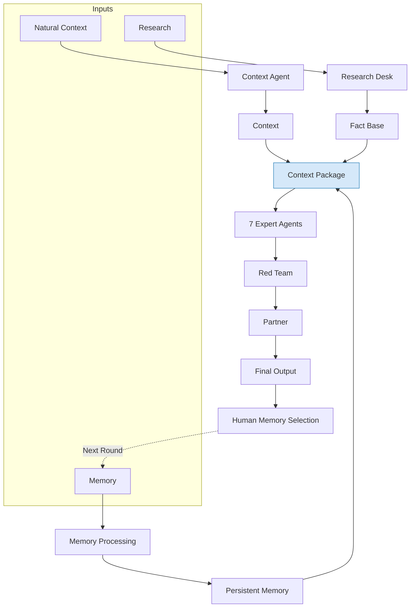
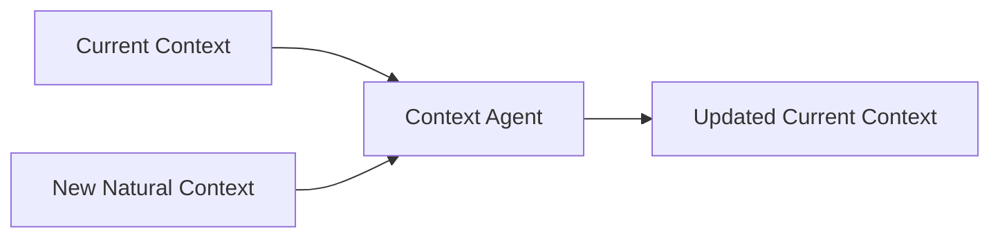
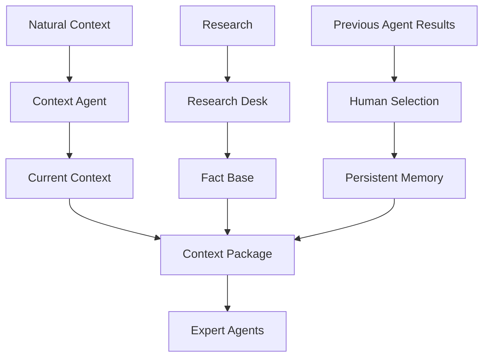

# Context & Memory Architecture

> 영문 정본: [`docs/CONTEXT-MEMORY-ARCHITECTURE.md`](../CONTEXT-MEMORY-ARCHITECTURE.md)
>
> **상태:** 이 문서는 목표(target) 아키텍처를 설명한다. Context Agent와 Persistent Memory 파이프라인은 아직 구현되지 않았다 — 현재 저장소는 `context/`(현재 컨텍스트), `inbox/`(투입 리포트), `reports/`(라운드 산출물)로 구성된 파일 기반 프로토타입이다. 현재/목표 구분은 [§12](#12-현재-구현과-목표-구조)에서 다시 정리한다. 실행 파이프라인 자체(7개 렌즈 → 레드팀 → 파트너)는 이미 구현돼 있으며 [`ARCHITECTURE.md`](ARCHITECTURE.md)에서 다룬다 — 이 문서는 그 앞단, 즉 렌즈들에게 무엇을 먹일지를 다룬다.

Bain-AC는 여러 전문 에이전트가 동일한 프로젝트 맥락을 기반으로 독립적으로 분석하고, Red Team과 Partner를 거쳐 전략적 결론을 만드는 멀티에이전트 전략 분석 시스템이다.

---

## 1. 전체 구조

Bain-AC의 핵심은 서로 다른 세 종류의 정보를 각각 적절하게 가공한 뒤, 하나의 공통 Context Package로 만들어 전문가 에이전트들에게 제공하는 것이다.



---

## 2. 세 가지 입력

### 2.1 Natural Context

Natural Context는 오늘 사람이 프로젝트와 관련해 자연어로 입력하는 비정형 정보다.

특정 포맷을 요구하지 않는다. 예를 들어:

- 오늘의 회의록
- 경영진과의 대화
- 고객/실무자 인터뷰 메모
- 오늘 정리한 생각
- 이메일이나 메신저에서 정리한 내용
- 리서치를 읽고 사람이 추가한 해석
- 프로젝트의 현재 상황에 대한 자유로운 설명

예:

> 오늘 CFO와 이야기했는데 독일 시장은 생각보다 빨리 들어갈 수도 있다고 했다. 다만 초기 투자금은 €20M 이상으로 키우고 싶어하지 않는다. 경쟁사 A의 가격 정책도 계속 신경 쓰고 있는 상황이다.

Natural Context에는 사전에 정해진 입력 스키마를 강제하지 않는다.

### 2.2 Research Materials

Research는 외부 자료를 별도로 제공하는 입력이다.

예:

- Google Sheets
- Notion
- Excel / CSV
- PDF 리서치 보고서
- 기타 문서

Research는 Natural Context와 동일하게 처리하지 않는다. Research의 핵심 목적은 주장을 검증하고 Fact Base를 만드는 것이기 때문이다.



Fact Base에는 가능한 한 source, evidence, access date, confidence/grade 등의 provenance를 유지한다. 이 등급 체계는 이미 `research-desk` 에이전트가 구현하고 있다 — 자세한 내용은 [`HOUSE-STANDARD.md`](HOUSE-STANDARD.md) 참고.

### 2.3 Human-selected Memory

세 번째 입력은 이전 회차의 Agent 결과 중 사람이 다음 분석에서도 기억할 필요가 있다고 선택한 내용이다.

**전회차의 모든 Agent 결과를 자동으로 넣는 것이 아니다.**



예:

> 독일 시장 진입은 2027년 이후를 우선 고려한다.

이 내용을 사람이 Memory로 선택하면 다음 분석에서도 사용할 수 있다.

따라서 Memory에는 단순한 사실뿐 아니라 다음이 들어갈 수 있다.

- 전략적 판단
- 의사결정
- 경영진의 방향성
- 프로젝트 제약조건
- 중요한 반복 Insight
- 이전 분석에서 유지하기로 한 가설

---

## 3. 세 입력은 서로 다른 노드를 거친다

세 정보원은 성격이 다르기 때문에 같은 프롬프트로 처리하지 않는다.

| Input | 의미 | 처리 노드 | 결과 |
|---|---|---|---|
| Natural Context | 오늘 사람이 제공한 비정형 맥락 | Context Agent | Context |
| Research | 외부 조사/리서치 자료 | Research Desk | Fact Base |
| Previous Agent Results | 사람이 보존하기로 선택한 과거 결과 | Memory Processing | Persistent Memory |

하지만 전문가 에이전트가 분석을 시작할 때는 이 세 결과가 Context Package로 결합된다.

---

## 4. Context Agent

Context Agent는 Natural Context를 단순히 요약하는 Agent가 아니다.

핵심 역할은 **비정형 자연어를 지속적으로 사용할 수 있는 프로젝트 Context로 변환하는 것**이다.



**주요 기능**

1. 중요한 정보 추출
2. 정보의 성격 분류
3. 기존 Context와 비교
4. 새로운 정보 / 변경 / 중복 / 충돌 판단
5. 다음 분석에서 사용할 Context로 통합

### 4.1 단순 Append가 아닌 Context Consolidation

예를 들어 기존 Context가 다음과 같다고 하자.

> 독일 시장 진입은 2027년 이후를 고려한다.

오늘 새로운 입력이 다음과 같다.

> CFO가 독일 진입을 생각보다 빠르게 할 수도 있다고 이야기했다. 다만 아직 확정된 결정은 아니다.

단순히 두 문장을 추가하면 서로 충돌하는 정보가 쌓인다. Context Agent는 이를 다음과 같이 정리할 수 있다.

> 기존에는 2027년 이후 진입이 기본 방향이었다. 최근 CFO가 조기 진입 가능성을 언급했으나 확정된 의사결정은 아니므로 기존 방향을 공식적으로 대체하지 않는다.

즉 Context는 단순한 Append가 아니라 기존 정보와 새로운 정보를 비교하여 Consolidation한다.

---

## 5. Memory는 모든 것을 기억하지 않는다

장기적으로 모든 Agent Output을 Memory에 넣으면 다음이 계속 누적된다.

- 오래된 판단
- 이미 폐기된 가설
- 당시만 유효했던 분석
- 서로 충돌하는 과거 의견

따라서 초기 구조에서는 **Human-in-the-loop를 기본으로 한다.**



사람이 선택한 정보만 Persistent Memory에 들어간다.

---

## 6. Context Package

세 입력을 각각 정제한 후 전문가 Agent에게 전달할 때는 하나의 Context Package를 만든다.

```
┌──────────────────────────────────────┐
│            CONTEXT PACKAGE            │
├──────────────────────────────────────┤
│ Project Context                       │
│ - Current situation                   │
│ - Management priorities               │
│ - Recent observations                 │
│                                        │
│ Verified Research Facts               │
│ - [F-001] ...                         │
│ - [F-002] ...                         │
│                                        │
│ Persistent Memory                     │
│ - [M-001] ...                         │
│ - [M-002] ...                         │
└──────────────────────────────────────┘
```

이렇게 하면 Strategy, Commercial, Finance 등의 전문가가 서로 다른 정보 기반에서 출발하는 문제를 줄일 수 있다.

---

## 7. Provenance는 유지한다

Context Package로 정보를 합친다고 해서 출처까지 하나로 합치면 안 된다. 각 정보는 자신의 provenance를 유지해야 한다.

| 태그 | 의미 |
|---|---|
| `[F-031]` | Verified Research Fact |
| `[C-014]` | Natural Context |
| `[M-007]` | Human-approved Memory |

따라서 전문가 Agent는 다음을 구분할 수 있다.

- 이 정보는 외부 자료에서 검증된 사실인가?
- 오늘 사람이 제공한 맥락인가?
- 과거 분석에서 나온 내용인가?

이는 `HOUSE-STANDARD.md`의 Evidence Contract와도 연결된다 — `[F-]`/`[C-]`는 이미 지금 렌즈들이 쓰는 태그 어휘이고, `[M-]`은 Memory가 구현되면 그 어휘에 추가되는 세 번째 provenance 종류다.

---

## 8. Expert Agents

Context Package가 준비되면 여러 전문 Lens가 동일한 Context Package를 기반으로 독립적으로 분석한다.

| Agent | 주요 역할 |
|---|---|
| Market Strategy | 시장 정의, 시장 매력도, 전략적 포지셔닝 |
| Commercial | 고객, 가격, 매출, 경쟁 |
| Corporate Finance | 수익성, 투자, 가치, 재무 |
| Operations | 생산, 공급망, 원가, 실행 가능성 |
| Organization | 조직, 인력, 역량 |
| Digital / Tech | 기술 변화, 디지털, 기술 대체 위험 |
| Risk / Regulatory | 규제, 리스크, 하방 위험 |



에이전트 구성과 각자가 쓰는 도구/모델의 차이는 [`ARCHITECTURE.md` § Two axes, not one](ARCHITECTURE.md#축은-하나가-아니라-둘)에 이미 정리돼 있다.

---

## 9. 전체 Round



§1의 다이어그램과 같은 흐름이다 — 여기서는 각 단계를 §2~§8에서 설명한 뒤 다시 한번 전체 그림으로 확인하는 용도다.

---

## 10. Fact Base와 Memory의 차이

둘 다 다음 분석에 사용될 수 있지만 목적이 다르다.

**Fact Base** — Research에서 검증한 사실

```markdown
[F-012]
Claim: Germany market size = ...
Source: ...
Evidence: ...
Grade: A
```

Fact Base는 가능한 한 엄격한 evidence/provenance를 요구한다.

**Memory** — 과거 분석에서 사람이 다음 Round에도 유지하기로 선택한 정보

```markdown
[M-007]
Germany entry should be considered
after 2027.
Source: Round 2026-08-17
Status: Human-approved
```

Memory는 반드시 객관적인 Fact일 필요는 없다. 전략적 판단이나 의사결정도 Memory가 될 수 있다.

---

## 11. Current Context와 History

Context Agent는 이전의 모든 원문을 매번 프롬프트에 넣는 방식으로 동작하지 않는다. 기본적으로는 다음을 사용한다.



원본 자료와 과거 버전은 History로 보존한다.

```
context/
├── current/
│   ├── project_context.md
│   └── ...
│
└── history/
    ├── round-001/
    ├── round-002/
    └── round-003/
```

필요한 경우에만 최근 N개 Round 또는 특정 과거 내용을 추가로 검색한다.

---

## 12. 현재 구현과 목표 구조

현재 repository는 파일 기반 프로토타입에 가깝다.

```
context/     → 현재 Context
inbox/       → 분석할 자료
reports/     → Round별 결과
```

현재 `context/`가 매일 자동으로 갱신되는 완성된 Memory 시스템을 의미하지는 않는다. 또한 처음부터 별도의 PostgreSQL이나 Vector DB가 필수인 구조도 아니다.

**목표 구조**



즉 이 문서에서 설명하는 Context Agent / Memory / Context Package는 현재 구현을 그대로 설명하는 것과 동시에 향후 확장할 목표 Architecture를 정의한다.

---

## 13. 향후 저장 구조

초기에는 Markdown/file-based 저장으로 충분하다.

서비스 규모가 커지면 다음과 같은 구조를 고려할 수 있다.

```
PostgreSQL
├── projects
├── contexts
├── memories
├── facts
├── documents
├── rounds
└── agent_runs

Object Storage
├── raw research files
├── source documents
└── generated reports
```

핵심은 단순히 LLM 대화 기록을 저장하는 것이 아니다. 다음 정보를 구조화해서 저장해야 한다.

- Fact
- Context
- Memory
- Decision
- Evidence
- Provenance
- Round
- Agent Run

그리고 매 Round마다 필요한 정보만 검색해서 Context Package를 구성한다.

Vector Search가 필요해질 경우 PostgreSQL + pgvector와 같은 방식으로 확장할 수 있으며, 처음부터 별도의 Vector DB가 필수인 것은 아니다 — `ARCHITECTURE.md`의 [왜 벡터 DB를 쓰지 않는가](ARCHITECTURE.md#왜-벡터-db를-쓰지-않는가) 절과 같은 이유다.

---

## 14. 설계 원칙

1. **비정형 입력은 비정형으로 받는다.** 사람에게 회의록이나 생각을 특정 스키마에 맞춰 작성하도록 강제하지 않는다.
2. **구조화는 Agent가 담당한다.** Natural Context는 Context Agent가 읽고 프로젝트 Context로 통합한다.
3. **Research와 Context를 분리한다.** Research Desk는 evidence verification을 담당하고, Context Agent는 project context consolidation을 담당한다.
4. **과거 결과는 선택적으로 기억한다.** 모든 Agent Output을 자동으로 Memory에 넣지 않는다.
5. **전문가에게는 공통된 세계를 제공한다.** 각 Expert Lens는 동일한 Context Package를 기반으로 분석한다.
6. **Provenance를 끝까지 보존한다.** Context, Research, Memory가 하나의 Package로 결합되어도 원래 출처와 성격은 유지한다.
7. **Human-in-the-loop를 유지한다.** 특히 장기 Memory에 들어가는 정보는 사람이 승인할 수 있어야 한다.

---

## 15. 한 문장 요약

Bain-AC는 자연어로 입력되는 프로젝트 맥락, 외부 Research에서 검증한 Fact Base, 사람이 선택한 과거 Agent Memory를 각각 적절한 Agent로 정제한 뒤 하나의 Context Package로 만들어 독립적인 전문가들에게 제공하고, Red Team과 Partner를 거쳐 전략적 결론을 만드는 시스템이다.
