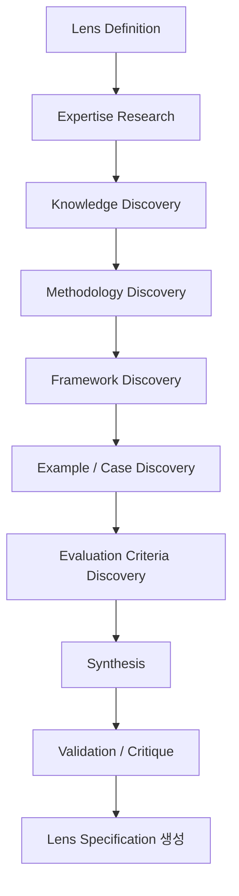
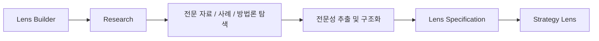
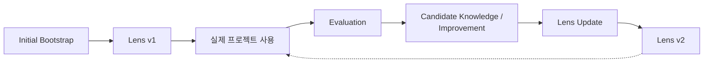
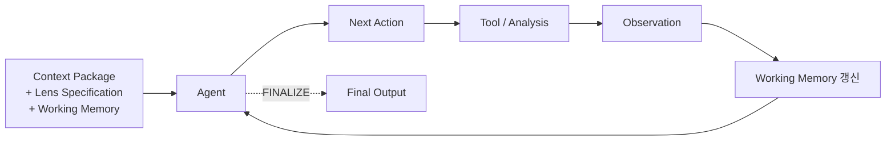
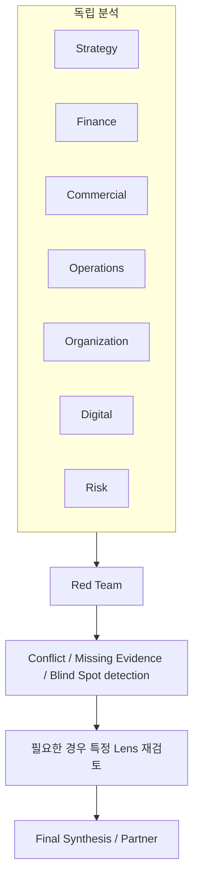
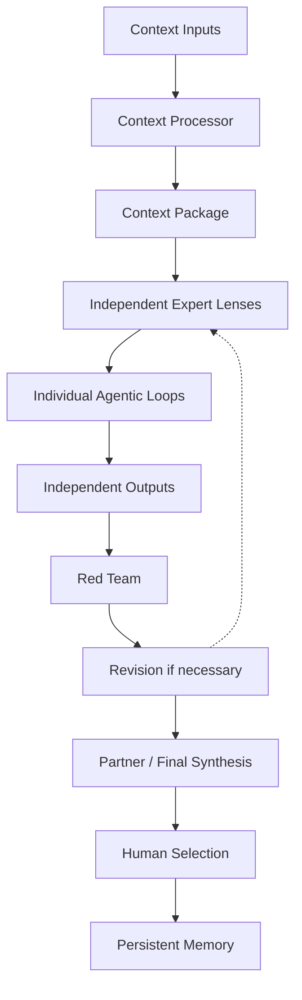
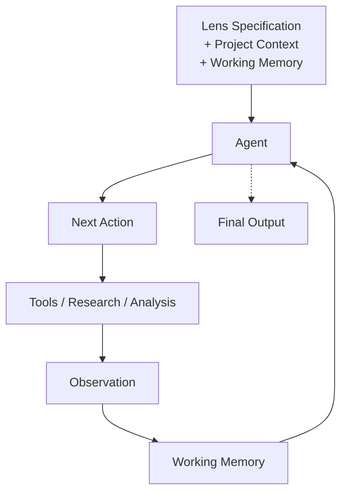

# Lens Architecture

> 영문 정본: [`docs/LENS-ARCHITECTURE.md`](../LENS-ARCHITECTURE.md)
>
> **상태:** 이 문서는 설계다. Lens Builder, Agentic Loop, Working Memory, RAG의 두 역할 구분은 **아직 구현되지 않았다.** 지금 실제로 도는 것은 §0의 표에 있는 항목뿐이다 — 7개 렌즈 에이전트가 정적인 마크다운 프롬프트로 존재하고, 병렬·격리 디스패치와 Red Team이 그 뒤에 순서대로 도는 구조는 이미 구현돼 있다. 패널 파이프라인 자체는 [`ARCHITECTURE.md`](ARCHITECTURE.md), 렌즈에게 무엇을 먹일지는 [`CONTEXT-MEMORY-ARCHITECTURE.md`](CONTEXT-MEMORY-ARCHITECTURE.md)에서 다룬다 — 이 문서는 그 둘 사이, 즉 **각 렌즈 내부**를 다룬다: 렌즈는 무엇으로 구성되고, 어떻게 전문성을 획득·구조화·저장하고, 실행 중에 어떻게 판단하고, 실제 사용을 거쳐 어떻게 개선되는가.

Bain-AC에서 Lens는 단순한 Prompt나 역할 지시문이 아니다. Lens는 "도메인 전문가 팀원"이다.

예: Strategy Lens, Finance Lens, Commercial Lens, Operations Lens, Organization Lens, Digital Lens, Risk Lens.

각 Lens는 동일한 프로젝트 Context를 받아서 자기 도메인의 관점에서 독립적으로 분석한다.

---

## 0. 현재 구현과 이 문서의 관계

이 문서에서 서술하는 요소 중 실제로 저장소에 존재하는 것과, 아직 설계로만 존재하는 것을 먼저 구분한다. 아래 각 절에서 해당 요소가 나올 때마다 이 표를 다시 인용한다.

| 설계 요소 | 현재 구현 | 상태 |
|---|---|---|
| Lens Specification (Role/Objective/Core Questions/…/Action Space) | `.claude/agents/lens-*.md`는 frontmatter(`name`, `description`, `tools`, `model`) + 자유 산문 본문뿐. `panel/agents.py`의 `parse_agent()`가 읽는 필드도 동일 | **미구현** — 지금은 사실상 Prompt만으로 정의된 상태 |
| 7개 렌즈의 `tools:` | 7개 전부 바이트 단위로 동일: `Read, Write, Glob, Grep, WebSearch, WebFetch`, `model: sonnet` | Lens마다 다른 capability 조합을 표현할 자리가 없음 |
| Lens Builder | 없음. 렌즈 파일은 사람이 직접 마크다운으로 작성 | **미구현** — 이 문서가 처음 정의하는 개념 |
| Agentic Loop / Action Space | `panel/runners/base.py`의 `AgentRunner.run()`은 system_prompt+task를 한 번 넘기고 결과를 받는 단일 호출. (Claude Agent SDK가 내부적으로 도구를 여러 번 호출하는 루프는 있지만, Bain-AC 코드가 그 루프를 Action Space로 노출·통제하지는 않는다) | **미구현** |
| Working Memory | 러너 호출 간 상태를 유지하는 자료구조가 없다 | **미구현** — 이 문서가 처음 정의하는 개념 |
| Iteration/Token/Time budget 통제 | `max_budget_usd`만 있고, 반복 횟수·시간 제한 개념은 없음 | 부분 구현 |
| 렌즈 간 완전 격리 | `panel/config.py`의 Phase 2가 `parallel=True`로 `asyncio.gather` 동시 디스패치 — 한 렌즈가 다른 렌즈의 출력을 볼 수 없다(시간적 격리) | **이미 구현됨**, 설계와 일치 |
| Red Team이 전체를 보는 첫 단계 | Phase 3 `red-team`이 7개 렌즈 완료 후 실행 | **이미 구현됨**, 설계와 일치 |
| Context Package | 미구현. 목표 아키텍처만 `CONTEXT-MEMORY-ARCHITECTURE.md`에 문서화돼 있음 | **미구현** |
| `skills:` frontmatter | 파싱은 되지만 소비하는 코드가 없음 | Lens Specification을 실을 잠재적 자리 — 가능성으로만 언급 |
| RAG / 지식 저장소 | `context/<domain>/` 8개 폴더가 비어 있음 | **미구현** |

---

## 1. Lens의 기본 정의

핵심 원칙:

> **Same Context, Independent Expertise, Independent Reasoning.**

즉:

- 모든 Lens는 동일한 Context Package를 받는다.
- 각 Lens는 자기 전문성/Knowledge/Methodology를 사용한다.
- Lens는 다른 Lens의 분석 결과를 자신의 분석 과정에서 볼 수 없다.
- Lens 간 결과 비교는 분석이 끝난 뒤 Red Team / Synthesis 단계에서만 이루어진다.

세 번째와 네 번째 원칙은 위 §0 표에서 확인했듯 **이미 구현돼 있다.** 나머지(Context Package, 전문성을 구조화해서 주입하는 방식)는 이 문서가 정의하는 목표 상태다.

---

## 2. Prompt만으로 전문성을 정의하지 않는다

다음과 같은 단순한 구조는 지양한다.

> "너는 최고의 전략 컨설턴트다."

**지금 저장소가 정확히 이 상태다** — 7개 렌즈 파일 모두 `tools:`가 바이트 단위로 동일하고, 차이는 산문 몇 문단뿐이다(§0 표 1·2행).

대신 Lens는 구조화된 **Lens Specification**을 가진다. 최소한 다음 요소를 포함한다.

- Role / Objective
- Core Questions
- Domain Knowledge
- Methodologies
- Frameworks
- Evaluation Criteria
- Evidence Requirements
- Common Failure Modes
- Reference Knowledge
- Agent Policy / Action Space

Prompt는 이 구조의 일부일 뿐이며 Lens의 전문성 전체가 아니다.

---

## 3. Fine-tuning을 사용하지 않는다

Bain-AC의 Lens 전문성을 LLM weight에 학습시키는 방식은 사용하지 않는다. Fine-tuning은 현재 설계 범위에서 제외한다.

일반적인 LLM을 그대로 사용하고 다음 요소를 조합하여 도메인 전문성을 구성한다.

- Lens Specification
- Domain Knowledge
- Methodologies
- Evaluation Criteria
- Reference Knowledge
- Tools
- Working Memory
- Project Context

```
General-purpose Model
        +
Lens-specific knowledge and behavior
        =
   Domain Expert Lens
```

---

## 4. Lens Builder

사용자는 도메인 전문가가 아니므로, Strategy/Finance/… 의 전문성을 사람이 직접 Prompt에 작성하는 것을 전제로 하지 않는다.

따라서 Lens를 생성/업데이트하는 별도의 meta-level 컴포넌트인 **Lens Builder**를 둔다. Lens Builder의 역할은 "실제 프로젝트를 수행하는 것"이 아니라 **"전문가 Lens 자체를 구축하는 것"**이다.

초기 Lens 생성 과정:



즉:



---

## 5. Lens Builder는 매번 실행하지 않는다

Lens Builder는 실제 프로젝트마다 전문성을 새로 조사하는 Agent가 아니다.

초기에는 **Bootstrapping**을 수행해 Lens v1을 만든다. 이후 실제 프로젝트에서 부족한 부분이나 새로운 전문 지식이 발견되었을 때 **Lens Update**를 수행한다.



**모든 프로젝트 결과를 자동으로 Lens에 영구 반영해서는 안 된다.** 장기적인 Lens Knowledge 변경은 검증/승인 절차를 거치는 것을 전제로 한다 — [§14](#14-lens-evolution) 참고.

---

## 6. RAG의 역할을 명확하게 구분한다

RAG는 Lens 전문성을 만드는 것 자체가 아니다. 두 가지를 구분한다.

| 구분 | 질문 | 언제 수행하는가 | 흐름 |
|---|---|---|---|
| **A. Expertise Acquisition** | "Strategy 전문가는 어떻게 문제를 분석하는가?" | Lens Builder의 초기/업데이트 과정 | Research → Knowledge extraction → Structure → Lens Specification / Knowledge Store |
| **B. Project-time Research** | "이번 프로젝트의 경쟁사 가격은 얼마인가?" | 실제 Lens Agent가 프로젝트를 수행하는 중, 필요할 때 | Lens → Research Tool → Current project information → Working Memory |

따라서 매 프로젝트마다 전문가 지식을 처음부터 검색하지 않는다.

---

## 7. Agentic Loop

각 Lens는 단일 Input → Output Prompt가 아니라 **Agentic Loop**를 가진다.

하지만 다음처럼 고정된 파이프라인을 만들지는 않는다.

```
Research → Analyze → Critique → Final
```

대신 Agent가 현재 상태를 보고 다음 Action을 선택한다.

예시 Action Space:

- `ANALYZE`
- `RESEARCH`
- `CALCULATE`
- `CHECK_EVIDENCE`
- `REVISIT_ASSUMPTION`
- `FINALIZE`



쉬운 문제는 한두 단계 만에 종료할 수 있고, 복잡한 문제는 여러 번의 Research / Analysis를 수행할 수 있어야 한다.

**현재 구현:** `AgentRunner.run()`은 단일 호출이다(§0 표). SDK 자체의 도구 호출 루프는 있지만 Action Space로 노출되지 않는다.

---

## 8. Agentic Loop의 통제

LLM에게 완전한 무제한 자율성을 주지 않는다. 코드 레벨에서 다음과 같은 제어가 필요하다.

- Action Space
- Maximum iterations
- Research budget
- Token budget
- Time budget
- Tool permissions
- Termination conditions

**원칙:**

| 요소 | 역할 |
|---|---|
| LLM | 판단 |
| Code | 통제 |
| Tools | 행동 |
| Working Memory | 상태 |
| Lens Specification | 전문성 |

**현재 구현:** `max_budget_usd`(달러 예산 상한)만 존재한다(§0 표). 반복 횟수·시간 제한·명시적 Action Space 통제는 없다.

---

## 9. Working Memory

Agentic Loop 내부에서 발생하는 중간 결과를 Working Memory에 저장한다.

예시:

- Findings
- Evidence
- Hypotheses
- Assumptions
- Open Questions
- Decisions
- Previous Actions
- Research Results

**중요:** Working Memory와 장기 Memory를 동일하게 취급하지 않는다. Working Memory는 현재 Agent 실행을 위한 상태다. 장기 Memory([`CONTEXT-MEMORY-ARCHITECTURE.md`](CONTEXT-MEMORY-ARCHITECTURE.md)의 Persistent Memory)에 저장할 내용은 별도의 저장/선택/승인 정책을 갖는다.

**현재 구현:** 없음. 러너 호출은 상태를 갖지 않는다(§0 표).

---

## 10. Lens의 Tool

초기 구현에서는 Tool을 과도하게 세분화하지 않는다. 기본적으로 다음 capability를 고려한다.

- Research
- Fact Base access
- Context access
- Memory access
- Calculator / Python / structured computation

Tool은 전문성을 만드는 것이 아니라 Lens가 전문성을 사용하여 실제 작업을 수행하기 위한 capability다.

```
Lens Expertise + Tools + Agentic Reasoning
```

---

## 11. 다른 Lens의 결과를 절대 참조하지 않는다

이 부분은 반드시 지켜야 한다.

Strategy Lens가 분석하는 동안:

- Finance output을 볼 수 없다.
- Commercial output을 볼 수 없다.
- 다른 Lens의 Working Memory를 볼 수 없다.

각 Lens는 오직 다음만 사용할 수 있다.

- 자기 Lens Specification
- Project Context Package
- 자기 Working Memory
- 자기 Research 결과
- 허용된 공통 데이터/Fact Base

**현재 구현: 이미 구현됨.** `panel/config.py`의 Phase 2는 7개 렌즈를 `asyncio.gather`로 동시 디스패치한다 — 한 렌즈가 실행되는 시점에 다른 렌즈의 출력 파일은 아직 존재하지 않으므로 원천적으로 읽을 수 없다. 다만 이건 *시간적* 격리다 — 파일시스템이나 네트워크 수준에서 접근을 강제로 차단하는 것은 아니라는 점은 별도로 진단된 바 있다(이 문서 범위 밖).

---

## 12. Red Team

모든 Lens가 독립적으로 분석을 완료한 이후에야 결과를 함께 비교한다.



Red Team 단계에서는 Lens 간 결과 비교가 허용된다. 하지만 이것은 개별 Lens의 독립적인 추론 과정과 분리되어야 한다.

**현재 구현: 이미 구현됨.** Phase 3 `red-team`이 7개 렌즈 완료 후에만 실행되고, 그 산출물(`02-red-team.md`)이 Phase 4 `partner-synthesis`의 입력이 된다.

---

## 13. Context Package와 Lens의 관계

프로젝트의 Context는 별도의 Context Processing 단계에서 만들어진다. 이 부분의 전체 설계는 [`CONTEXT-MEMORY-ARCHITECTURE.md`](CONTEXT-MEMORY-ARCHITECTURE.md)가 정본이다 — 여기서는 Lens와 맞닿는 부분만 요약한다.

핵심 입력 세 가지:

1. **Natural-language Context** — 회의록, 대화, 인간이 자유롭게 작성한 생각, 정리되지 않은 메모, 기타 포맷 없는 자연어 정보
2. **Research** — 별도 리서치 자료(Spreadsheet, Notion, 외부 문서 등)
3. **Selected Previous Results / Memory** — 과거 Agent 결과 중 인간이 선택하여 장기적으로 남긴 내용

이 세 종류를 각각 적절히 처리한 뒤 하나의 Context Package로 만든다. **모든 Lens에는 동일한 Context Package가 들어간다.** 단, 각 Lens가 이를 해석하고 사용하는 방식은 자기 전문성에 따라 달라진다.

**현재 구현:** Context Package 자체가 미구현이다(§0 표). 지금 렌즈가 받는 입력은 입력 리포트 원문, `01-fact-base.md`, `docs/HOUSE-STANDARD.md`, `context/00-core-brief.md`(대개 비어 있음)뿐이다.

---

## 14. Lens Evolution

Lens는 고정된 Prompt가 아니다. 실제 프로젝트에서 다음과 같은 신호를 수집할 수 있다.

- 반복되는 실패
- 누락된 분석
- 잘못된 가정
- 새로운 방법론
- 새로운 Evidence requirement
- 특정 산업에서 반복되는 특수한 고려사항

이런 정보는 바로 Lens에 영구 저장하지 않고 **Candidate Knowledge / Candidate Improvement**로 분리한다. 검증/평가/승인을 거친 후에만 Lens Specification을 업데이트한다 — [§5](#5-lens-builder는-매번-실행하지-않는다)의 Bootstrap/Update 사이클과 같은 절차다.

---

## 15. 전체 Architecture

**전체 파이프라인**



**Lens 내부**



두 다이어그램은 각각 §1(전체 구조 원칙)과 §7(Agentic Loop)에서 이미 설명한 내용을 하나로 모은 것이다.

---

## 참고

이 문서 전체에서 "현재 구현"으로 인용한 사실은 [§0](#0-현재-구현과-이-문서의-관계) 표에서 확인한 것이며, 이번 문서화 작업에서 그 구현 자체는 변경하지 않았다. 아직 구현되지 않은 기능을 구현된 것처럼 서술한 곳이 있다면 그건 이 문서의 결함이다 — 그런 경우 §0 표를 기준으로 판단할 것.
